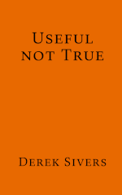

## [Useful Not True](/books/useful-not-true) <small style="font-size: 0.4em"><a style="color: black" href="https://sive.rs">by Derek Sivers</a></small>

**Belief** generates **emotion** which generates **action**, but what you believe is not true. Adopt a useful belief that generates the emotion which impels the action that you need now to reach your ultimate destination.

## [How to Read a Book](/books/how-to-read-a-book) <small style="font-size: 0.3em">by Adler, Van Doren</small>

You know how when you buy a book and you open it to page one and start reading until you're done? Well, you're missing out on a much richer and more enlightening reading experience. There's a better way...

## [Internal Time](/books/internal-time) <small style="font-size: 0.4em">by Till Roenneberg</small>

I started a sabbatical recently and I quickly noticed that without an alarm, I started to go to bed progressively later. Now I go to bed at around 4 and I get up at around noon. I’m not sleeping more, it’s just the schedule shifted. What's going on? Enter the fascinating world of Chronobiology.

## [Unlimited Memory](/books/unlimited-memory) <small style="font-size: 0.4em">by Kevin Horsley</small>

**[WIP, currently reading]** Memorizing is part of almost every activity that I've been doing lately. I'm curious about how the pros do it and if I can use their methods to do it properly.

<article class="book">
    
    <a href="books/useful-not-true" class="book-title">
        <h2 class="book-title">Useful Not True</h2>
    </a>
    
by Derek Sivers

    
Belief generates emotion which generates action, but what you believe is not true. Adopt a useful belief that generates the emotion which impels the action that you need now to reach your ultimate destination.
        more wordsk
        more wordsk
        more wordsk
        more wordsk
        more wordsk
    

</article>
