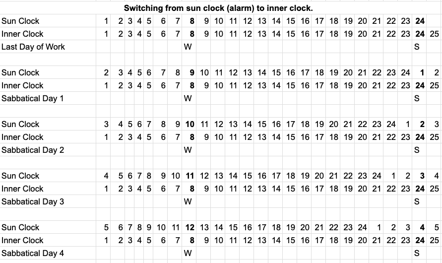
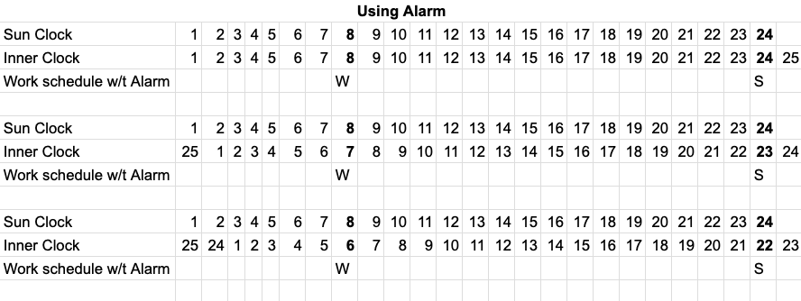

by Till Roenneberg, [buy it here](https://a.co/d/3mxyZOL).

I started a sabbatical recently and I quickly noticed that without an alarm, I started to go to bed progressively later. Now I go to bed at around 4 and I get up at around noon. I'm not sleeping more, it's just the schedule shifted. It feels wonderful not using an alarm, but not without guilt because I have a "wake up early or you're a loser" stigma for various reasons, but my body is disagreeing with this. I read this book to see if it will help me overcome my stigma, shed the guilt and to discover if there are any negative health consequences with living with this type of schedule. Enter the fascinating world of Chronobiology.

## TL;DR

If my lifestyle doesn't require that I get up at a specific time, then maintaining a shifted schedule is perfectly fine as long as it's stable and regular to get all the other inner clocks aligned.

Midsleep[^1] and sleep length are independent of each other. Oversleeping or under sleeping are not what's being discussed here. Currently, I need around 8 hours.

If I want to maintain a social[^4] clock and sun clock friendly schedule without using an alarm, I have to expose myself daily to ample natural light as early (inner clock early) as possible for as long as possible. After dusk, avoid blue light completely. Same for resetting a late schedule if needed[^5].

[^4]: social as in work, or activities with non late chronotypes.
[^5]: I've tested on a [camping trip](/camping-sierra-de-la-ventana) recently and it actually worked!

## Full Version

There are at least three clocks that we're exposed to: **sun clock, inner clock and social clock.**

**Sun clock** is one of the few predictable things on earth. It's defined by the rotation of the earth around itself. It completes the rotation in about 24 hours.

**Our inner clock** (biological clock, circadian clock), is really a thing: a cluster of about 20,000 neurons (size of a grain of rice) located above where the optic nerves cross in the brain. It rarely matches the 24 hour sun clock; it tracks a shorter day or a longer day **depending on what genes you inherited from your parents**. It's more than a clock, it's actually a pathway with inputs, clocks and outputs. One of its inputs is the light-dark cycles of the sun clock. Some of its outputs are midsleep[^1], body temperature, hunger and hormone regulation.

[^1]: midsleep is the midpoint between when you go to bed and when you wake up. e.g. If you go to bed at midnight and wake up at 8, your midsleep is 4.

**The social clock** is the time you have to be at work, take the kids to the game, your buddies are at the pub, etc...

**So why did I start going to bed at 4am?**

It's most likely[^2] because my inner clock day is longer than the sun clock day.

[^2]: or could be Delayed Sleep Phase where internal clock runs on 24 hours but is phase-shifted later relative to the solar day. This is different from having a longer internal day. Your body has found its natural preferred timing within the 24-hour cycle, it's just that your preferred timing is offset from conventional social schedules.

Let's assume my inner day is 25 hours long instead of the sun's 24 hour day and that I go to bed from midnight to 8. This means that after I stopped using my alarm, and switched to my inner clock's schedule, I wake up the following day 8am inner clock, but at 9am sun clock. This is because my inner day is 1 hour longer than the sun's day.

<figure>
    
    <figcaption>Notice how the sun clock is drifting every day pushing my wake up time later and later.</figcaption>
</figure>

This misalignment between inner and sun clock also reveals why I felt so tired when I had to use the alarm to wake up at 8am. When we're pegging the wake up time to the sun clock, the inner time drifts. My body was thinking that I'm waking up at 6 and going to bed at 22. Not what it wants.

<figure>
    
    <figcaption>Notice how my inner clock is drifting every day making my body believe that I'm waking up at the crack of dawn.</figcaption>
</figure>

**But why did my drift stop at 4am?**

It turns out that the inner clock is built with a self correcting mechanism in order to synchronize itself with sun clock's day length. This dynamicity allows it to adapt to variations in day lengths throughout the seasons. i.e. Help make inner clock 24 hours just like sun clock. The mechanism works by tracking daylight and nightdark[^3]:

[^3]: term coined by Till to mean opposite of daylight. Think natural pitch darkness.

* If you expose the inner clock to light during inner dawn time, you shorten the inner day.
* If you expose it to light during inner noon time, nothing happens.
* If you expose it to light during inner dusk time, you lengthen the inner day.

So although I stopped using the alarm, I kept going outside and exposing myself to sunlight which shortens my inherited long inner day. If I were in a controlled environment without any light, I would probably drift indefinitely 1 hour per day.

**Why did I feel tired on alarm schedule if inner clock could synch with sun clock?**

Part of the self correction that the inner clock has is it tries to increase light exposure to the shortening window when it needs to shorten the inner day and inversely, it tries to increase the light exposure to the lengthening window when it needs to lengthen a short inner day. As it does so, it hides the lengthening window in the former case and the shortening window in the latter case.

So when it needs to shorten a long inner day by exposing the most inner dawn to light, the sun clock and inner clock don't align at 0/0 hour or say, dawn/dawn hour. The inner clock shifts its dawn later than sun clock dawn to get more light in, so if you were to wake up at inner dawn, sun dawn would have already taken place. In my case, I would feel tired when I set the 8am alarm, because my inner clock, although might have been a 24 hour day, is still shifted. So sun 8am could actually be 6 or 7am inner clock time.

To make up for this, one could increase the light intensity so the shift is less. The shift lessens, because with strong zeitgeber, less time exposure is needed to shorten the day for a long day inner clock like mine.

## Raw Notes

Actual chronotype (calculated according to midsleep on free days)
Social Time: social time that we use in everyday life to be on time for work, travel, appointments, or the evening news. Social time is the time people live by.

Social Jetlag
Living against our biological clock also jeopardizes our health and well-being

Sun time

Internal time

midsleep The calculation of midsleep is easy: if a person usually falls asleep at midnight and usually wakes up at eight, then his usual midsleep is 4 A.M. midsleep was introduced to characterize when people sleep, which also gives us an indication of
the relationship between an individual’s internal time and local (external) time.

(called entrainment) of how the clock synchronizes to the twenty-four-hour day.

Your internal time is produced by your own body clock. It varies from individual to individual just as body height, eye color, or personality varies, and it interacts with sun time and social time. In spite of internal time being probably the most important to our health and well-being—more important than sun time and certainly more important than social time—it has been thoroughly neglected.

This book will tell you how these different time systems interact: sun time, social time, and your
very individual internal time. Your internal time is produced by your own body clock. It varies from individual to individual just as body height, eye color, or personality varies, and it interacts with sun time and social time.

I noticed that people were fascinated and eager to learn about the science behind circumstances
of their daily existence, some of which they had never considered before. Once enlightened, they
started to understand themselves (and others) much better, began to appreciate their own
individual time, and were suddenly relieved of the weight of prejudice ridiculing their temporal
habits: for example, being called lazy if you don’t wake up fresh as a daisy by seven o’clock in
the morning; or being called a boring person only because you don’t enjoy going out with friends
after ten at night.

sleep has (at least) two different and independent qualities: sleep timing and sleep duration. Although duration and timing are the two major qualities of sleep, they are independent
from each other. the notion that people who get up late sleep longer than others is simply wrong. usual structure: two-thirds awake and one-third asleep

Categories like larks and owls, A and B people, misrepresent the continuous distribution of
chronotypes as much as dwarves and giants misrepresent the distribution of body height. These
opposites simply label the extreme types at both ends of distributions, which are extremely rare.

The internal timing of our body clock, of which sleep habits are just one aspect, dominates all
functions in our body, ranging from genes being activated at certain times, to changes in body
temperature and hormonal cocktail, right up to cognitive functions like the ability to do math. If we wake up in the middle of the night, we don’t cook ourselves a meal—we are not hungry. So
why should Ann be hungry just because she is being woken every school day at around her
internal midnight?

The moral backbone of practically every culture declares early risers as good and late risers as
bad people. Early-riser morals

> There is, a couplet from a Punjabi Sufi poet, Baba Bulley Shah, to the effect that if God could be attained by getting up early, surely the roosters would have found God.

This myth that early risers are good people and that late risers are lazy has its reasons and merits in rural societies but becomes questionable in a modern 24/7 society.

We don’t fall asleep just because we are exhausted; there is another factor that controls our
capacity to fall asleep and to benefit the most from our sleep, and that factor is the biological
clock. In fact, you may not be able to fall asleep no matter how exhausted you are. Our flexibility in how and when we catch up on our sleep need is, however, limited by our
internal timing system, as Sergeant Stein discovered during his sleep study. At some times we
can fall asleep easily whereas at others we find it almost impossible—no matter how exhausted
we are.

First, our body’s internal day is controlled by its own biological clock (as in most other creatures).
Second, because clocks do not generate an exact twenty-four-hour day, they obviously must be
periodically set—how else could they be of any advantage in real life? Third, this internal timing
system can differ from individual to individual. Finally, we feel best if all of our bodily functions
oscillate in synchrony.

we know that we can make the body clock run free by simply keeping subjects in a windowless
room, so they do not perceive natural night and day or read the local time from any device.

Light is the main signal that resets the body clocks of plants and animals, including humans, to
the twenty-four hours of the earth’s rotation.

discovered that all of the resulting offspring had an even faster clock than their unusual ancestors.

The last chapter demonstrated that one can find dedicated genes which are essential for the
body clock to tick properly and that their function within the clock appears to be the same
(conserved) across very different species—from insects to humans.

The circadian system is not merely a neuronal center that ticks away in our brain. It is an entire
pathway with inputs, clocks, and outputs. This pathway starts by detecting light or darkness in
the eyes and sending this information to the clock neurons in the SCN. These in turn inform other
parts of the brain (for example, sleep centers) or organs like the liver about what internal time of
day it is. All the components of this pathway are important in determining our chronotype.

 our body’s temperature swings from a low in the late night to a high in the evening.

speak foreign languages also change over the course of the day.

The gene they investigated was only activated toward the end of the rat’s sleep phase. Oliver’s findings indicated that the circadian clock apparently controls the activation and
deactivation of individual genes. Clearly, metabolism is under the control of the circadian clock.

a single cell could contain more than one circadian clock.

We have already covered the main factors that determine when we fall asleep: internal timing and
the amount of sleep pressure we have built up over the time we are awake.

that the closer we are to our usual end of sleep when we wake up, the harder it is to fall asleep
again

We feel tired when our brain cools down, and we feel awake when our brain warms up (if it doesn’
t become too hot).

Depending on how well and how long we slept during the preceding night, we can either fight this
lunchtime dip or, if we cannot muster any resistance, doze off—at least for a power nap. Light
helps to win the battle for wakefulness while darkness fights with great success on the other side.

Most elderly people hardly ever get the chance to go outside, and the television is often their
main light source. As a result, their body clock is not synchronized properly.

 It seems that an additional quality of being a late or an early type is related to sleep
pressure. Early types apparently build up sleep pressure more rapidly than late types. In addition,
early types don’t have the ability, as late chronotypes do, to “sleep in” after having gone through
sleep deprivation.

Few people know that the rotation of our planet has slowed down in its unimaginably long life history. This process has not stopped, so days on Earth will be close to twenty-five hours in a very, very distant future. Thus biological clocks can obviously adapt to different day lengths. This long-term adaptation is, however, different from sending people to other planets where they would arrive within months or years. The evolutionary adaptation generates different versions of clocks with altered or even new genetic components whereas the synchronization to days on other planets must be achieved via the principles of entrainment.

Successful entrainment ensures that the body clock produces internal days that have on average the same length as the external days of the cyclic environment. You already know that the clocks of different individuals run differently (by inheritance) and may, therefore, produce days that are longer or shorter than the rotation of our planet (as if these people were made for a life on other planets).

If individuals’ clocks, producing internal days that are shorter than twenty-four hours, have to entrain to the rotation of Earth, then their internal days have to be lengthened.

If individuals’ clocks, producing internal days that are longer than twenty-four hours, have to entrain to the rotation of Earth, their internal days have to be shortened (the most common scenario for humans).

how does a circadian clock entrain to a zeitgeber, or external cue?2 Technically, anything that produces a rhythm is a kind of oscillator (like a swing or a pendulum). But how can the period of an oscillator be adjusted to the period of another rhythm? Let’s presume that the body clock is a swing that is being pushed by a zeitgeber (for example, the light–dark cycle). To synchronize the body clock, the zeitgeber has to systematically interfere with the momentum of the swing. (Admittedly, a swing is a strange representation of the body clock and the pusher an even stranger impersonation of a zeitgeber.)

Whenever the zeitgeber pushes, the swing’s reaction will depend on when during the swing this happens. If the swing is pushed while it is moving away from the pusher, it will speed up; if it is pushed while moving toward the pusher, it will slow down or even stop.

If the clock thinks that it is past midnight (internal time) but suddenly sees light, it might say, “Oh, gosh, it’s already approaching dawn. I really have to hurry up!” If the clock thinks it is already past sunset but then sees light, it might say, “Golly, it’s still light out there, I really have to slow down and get back on track!” If the clock is notified by the eyes that is broad daylight and it thinks it is midday, it might lose its patience and respond, “I know it’s day! Please bother me only if there is something to report that I don’t already know!”

This new theory is based on a “response characteristic” that shows how sensitive the clock is toward light at different times during its internal day and indicates whether light shortens (compresses) or lengthens (expands) the internal day.

Entrainment is nothing more than making the internal day fit the external day—either by compression or by expansion.

Successful entrainment ensures that the body clock produces internal days that have on average
the same length as the external days of the cyclic environment.

most human clocks produce longer days, which therefore have to be compressed. To achieve
this, the clock simply exposes more of its compression portion to the light and “hides” more of its
expansion portion in the dark.

Jetlag: As the word says, it takes a jet to elicit this state because the main cause for this syndrome is the
speed at which we travel from one time zone to another, from one time of dawn to another, from
one time of dusk to another, and from one different social timing to another.

According to the principles of entrainment, we would become slightly earlier chronotypes when
travelling west and slightly later chronotypes when travelling east. As a rule of thumb, it takes the body clock approximately one day per travelled time zone to
adjust to the new cycle of light and darkness, so that Bostonians travelling to Japan would need
approximately twelve days until they functioned normally again.

Most people can adjust more easily when flying to the west. Going west, their
clock adapts by expanding their internal days, which are already longer than twenty-four hours.
Accordingly, adjustments after travelling in the opposite direction are more difficult, especially for
late chronotypes.

early types report adjusting faster and more easily when travelling from west to east.

The results of these experiments suggest that the clock in the liver can be entrained by food,
while the master clock in the brain, the SCN, continues to entrain exclusively to the light–dark
cycle. Under these conditions, the normal circadian harmony of the different body clocks is
pulled apart.

You meanwhile know that sleep duration and sleep timing (chronotype) are two independent,
heritable traits.

It is a remarkable fact that every time I find evidence for a biological basis for human behavior, I
am confronted by the conviction that the same results could be explained far better by cultural
causes.

It is quite remarkable that we find—in the first part of the twenty-first century—that our body
clocks still live very much like those of our ancestors, namely by sun time, while our entire social
life has to conform to a different schedule.

While the farmer kept to his old habits, the factory worker went to bed later and later and now
definitely needed an alarm. (referring to the twin experiment).

Based on these highly subjective self-assessments, spending two hours or more outdoors can advance an individual’s chronotype by about one hour.

the body clock becomes later from east to west by approximately four minutes per
degree of longitude—the same amount of time per degree of longitude that the sun takes to
move from east to west.

Reducing the sun’s seasonal amplitude is equivalent to a virtual journey toward the
equator. For people living in Central Europe, the interference of DST therefore corresponds to a
virtual journey from Frankfurt to the south of Morocco and back.

Yet people become earlier and earlier in their chronotype with age and thereby may lose their
endurance and their capacity to stay up late

This contrasts with how women assess their partners: the later their own MSF-based chronotype,
the later they judge their partner’s.

Men go to bed at different times (in most cases later) when their partner is not home, indicating
that men adapt their sleeping habits to those of their partner.

For example, if an individual was an intermediate chronotype (based on MSF) but the partner was an extreme owl, then he might consider himself an early type just because the partner’s
chronotype is much later. Our results confirmed this hypothesis.

in reality, the actual chronotype differences between men and women continually decrease from
twenty to fifty-two (becoming indistinguishable at higher ages).

What I do remember is that the subjects reported after the experiment was over that whoever
thought they knew what “rested” meant had no idea what they were talking about. (on sleeping at sunset and getting up at sunrise resutling two sleeping sessions with wake in the middle of the night interlude).

It is quite remarkable how many aspects of our lives are influenced by industrialization and its
consequences, isolating us increasingly from natural signals. To allow organisms to
accommodate and anticipate the natural changes across day and night but also across seasons,
evolution has developed internal clocks.

our modern selves are still under attack, only by much smaller but just as dangerous enemies like
bacteria, fungi, or viruses—and these enemies are still seasonal. An appropriate timing system in
our body would therefore still be useful—at least for our immune system. But our internal clocks
are only effective if we provide them with sufficient information: with sufficient differences in daily light and darkness, or with sufficient contact to changing photoperiods and temperatures. Tom’s
experiment made Barbara and Gerry live strictly by photoperiod, and neither of them developed a cold that winter.14 You probably guessed the rationale behind the pink glasses, the filter sheets,
and the special light bulbs. After dusk and before dawn, they aimed to shield Gerry and Barbara
from that part of the light spectrum that reaches our timing system most effectively (the blue
parts of the light spectrum).

This result strengthens the notion that decision makers are more likely to be early types and short
sleepers, simply by selection. Their sleep behavior efficiently protects them from falling ill,
thereby making them overall more successful compared with late types and long sleepers, who
would regularly suffer from social jet lag if they had to comply with a decision maker’s daily
schedule.

chronotype and the individual need for sleep apparently have an effect on our lives and our
choice of career;

The ability of some people to program themselves to wake up at a certain exact time is another
example where the body clock is used in its literal function. Although this ability is not part of the
body clock itself, it uses its “knowledge” about time of day. (Leon used this ability to reset the
timing of his regular nocturnal awakenings.)

Our internal clock is not only important in making our body do the right things at the right times; it
has also been a crucial player in our very own mammalian evolution. In this chapter you have
seen the great advantages of flexibility in occupying niches on an evolutionary scale. The wide
variety of chronotypes in modern populations potentially provides similar flexibility.

our body clock doesn’t simply respond to social cues but uses its own response characteristics
for synchronizing to day and night, light and darkness on earth.
