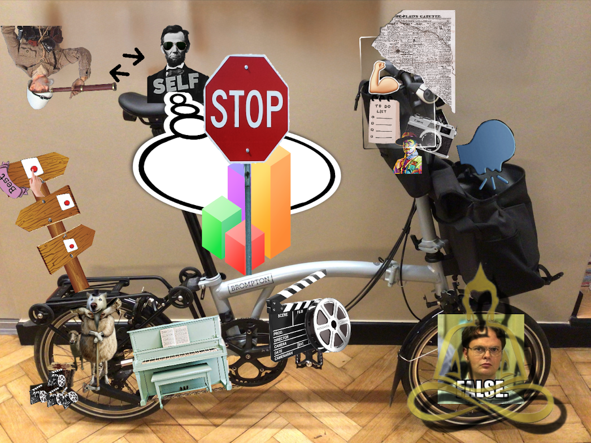

Since high school, I had been memorizing by rote repetition. It turns out that that's the least effective way to memorize. Our mind is setup to memorize differently. This books showed me how.

_Some parts are written in the first person because I'm using this as a workbook and taking my notes as I experiment with the methods._

If I believed my limitations, then my life will be bounded by them. So step zero is to assume that my memory is limitless. Use [Useful Not True](/books/useful-not-true) notes for help on this.[^1][^2]

Memory comes down to the four Cs.

[^1]: if you need motivation and guidance specific to memory work, reread the first three chapters of Unlimited Memory.
[^2]: as I started to use the methods in this book, I started to feel pushback against memorizing more as if memory in my brain was limited. You really need to internalize the fact that our memory expands the more we memorize, otherwise, you'll start giving up. Another thinkg I started feeling is like this whole thing is very childish, but as soon as I saw how powerful it is, I realized that it's not childish, it's child-like: children soak up knowledge like a sponge. They play.

## The first C: Concentrate: Setting Up the Mental Space

You need to have a very specific purpose for why you're memorizing the material at hand. Is it to impress someone? To learn a language? To learn the basics of some field then create or excel in it?  With a clear purpose, you'll eat the material up. Without one, boredom will take over. Use the PIC principle[^3].

More dangerous than boredom is worry. Worry is the opposite of peace and you need peace of mind to concentrate. **Eliminate worry** then come back to memorize [^4]. Learn to practice peace, because if you have no attention you have no retention.

[^3]: PIC principle: Purpose: keep the purpose front of mind the whole time. The more specific the more it will help you concentrate on the data. Interest: Attention deficits are mostly interest deficits. Your mind never wanders; it moves toward more interesting things. So learn how to generate interest by linking what you're learning and memorizing to how it will affect the physical world, i.e. find a direct link between the material and your goal. Curiosity: ask motivational questions that pique your curiosity so you dig deeper into the data. How much more capable will memorizing this make me? What's the limit? Will this show me new ways of doing things?

[^4]: You don’t worry because you care; you worry because that is what you have learned to do. Worry is a creative mental process. By asking yourself “what if” questions, you set your mind up to worry. If you consistently ask, “What if I lose my job?” “What if I crash my car?” “What if criminals attack me?” then you will create “movies” in your mind that constantly loop those scenarios and cultivate a state of worry. Rather, say to yourself, “What would I do if I lost my job?” or “What would I do if I crashed my car?” The movies created by these questions don’t loop you into worry. They give you action steps that direct your mind. **Create a procedure for different scenarios and make peace with your thinking.**

## The Second C: Creativity

Sound is the least effective way to remember because it's sequential and our mind is not wired to attach sounds to other memories. So repeating a sound and hoping it sticks is not how to memorize.

Remember that your imagination is like the pen and the systems (peg, car, journey, etc... below) are the paper.

### SEE Principle

Mind images and mind movies are the most effective because they involve all five senses. So I'm going to use the SEE principle to memorize. Senses (S): I will use all my senses when creating images or movies of what I want to remember. Exageration (E): I will exagerate what I'm imagning. It wont' be a life sized banana. It will be a banana so big it touches the moon. Energize (E): I'll make the images move, act in illogical ways: weave, crash, stick, or wrap things together to help me remember them. Make things talk, sing, and dance. The moon squashes the banana.

Most abstract words can also be made into mental pictures. Just use a meaningful thought or word to represent an abstract word. Find a word or phrase that sounds the same as or similar to the abstract word, or break up the word into its individual sounds create images for each.

Examples of how I can remember Spanish words:

* Cat is gato. Imagine saying to your friend, "You’ve **got to** hold my **cat**."
* Chicken is pollo. You can imagine playing **polo** with a **chicken** instead of a ball.
* Tiger is tigre. It sounds like “tea gray.” To perfect the pronunciation, imagine a **tiger** drinking **tea** that has turned **gray**.
* Sun is sol. Imagine that the **sun** is burning the **sole** of your foot.
* Gancho is hook. Imagine a cartoon cowbow with a huge **hooked** nose loading his **gun** with **chorizo**.

**Imagination first:** at first I was verbally matching words, but noticed better success by alternating between imagining and verbal matching. For example, for Gancho, I was first trying to think what sounds like gancho (gan cho, g ancho, etc...), but then switched to picturing a hook in my mind and suddently I started to see a fishing hook, then a big hooked nose, etc... from there I built the example. Every word in any language is only a picture drawn with letters.

**The picture or movie are what I'm after, not words and voice:** I noticed that after I came up with the images above, I started to memorize them by hearing as usual. This defeats the purpose of what I'm learning here. Instead, picture the images and movies in your head using all senses. Exagerrate the keywords. SEE principle[^5].

[^5]:_After doing this exercise, I feel like I haven't actively used my imagination in a long time. This exercise will have many benefits in all areas of thought related work. Thinking using imagination and actively linking already feels super powerful._

You can expand on this method by using mindmaps, using google images, google maps in 3d mode to go into museums and castles and famous houses in order to create memory journeys. You can act out the images or link them up as a story board like they do in the movies. Even create a whole story line in your head to act out whenever you want to remember the info. Another effective way is doodling or drawing the information yourself in order to remember it better. Storylines and images that have you as the protagonist work best.

### Car Method

The SEE principle is the basic building block to remember bits of information. But in order to remember this information long term, we need to organize it in our mind. We do so by using something that's already in our long term memory (LTM) and organize the short term memory (STM) items on it.

**Superior organization leads to superior learning and memorization.**

When visualizing something to memorize it, always use as few pictures as possible to remember as much as possible. The simpler and clearer the picture is, the less overwhelmed you will feel.

The theory is LTM + STM = Medium Term Memory (MTM). If you review MTM items (in 2 days, 5 days, 1 week, 2 weeks, 4 weeks, 6 weeks) they'll start converting to LTM and then you can use those new LTMs to store new MTMs on them!

I'm going to test this out on my bike since I don't have a car, but usually, you'd use your car and past cars to do so. What I want to memorize is the **Adopt What Works For You Now** section of [Useful Not True](/books/useful-not-true). This method respects order so it can be used for ordered items like I'm doing below.

<figure>
    
    <figcaption>Adopt What Works For You Now - Useful Not True</figcaption>
</figure>

1. **How to Decide and Make the Best Choice**: No choice is the best in itself. It becomes the best when you choose it. _We start on the rack, with an image of a signpost with a hand pushing the button to make the choice final, therefore the best_.
2. **From Explorer to Self Leader**: After choosing, you need to switch from explorer to leader leading yourself. All you know now is: **Here's where I'm going. Here's why. Here's how. Let's go!** _I chose an image of an explorer that we don't need anymore so he's not on the bike, but he's switched to Pres Lincoln the Leader sitting on the seatpost leading himself on the bike._
3. **No New Instructions For The Computer**: As a leader, stop taking in instructions or you'll never finish the job. Instead, you'll start over or switch. _On the bike's frame an image of data with stop sign to remind the Pres to stop taking in new info and start acting._
4. **Private Journal to Internalize it:** journal to strengthen the choice we made by stacking up reasons (here's how this will help me or others), clarify it so we can explain it to others in 10 seconds, plan it with specific actions so we can execute, picture yourself how you'll be after the road is taken, prepare for future self that will try to revert you to your old self. _On the steering pouch we have a journal showing inside it an arm (strengthen), a clear glass (clarify), a todo list (plan), a camera (picture) and a scoutmaster (prepare)._
5. **Talk with Friends To Solidify it:** We know ourselves through others. They might see an angle or consequence you hadn't considered. _In the front bag an image of me talking to my friends that I keep in my bag._
6. **Why Your Choice is Wrong:** Some of your friends or aquaintances will tell you you're wrong. It's not what they need. It's not what people around them do. **But this is only for you and only for now.** No need to argue that it's true. You'll probably do something else in a few months or years. _On front wheel, an image Dwight from the office says you're wrong, but he's overlayed with a here-now buddha to remind us that this is for us and only for now._
7. **Take The First Step Immediately:** Taking action tests your thought in reality. Do it now! Unless it's something that could hurt you or others long term then sleep on it for a while before rolling. _On the pedal (momentum), I have a clapperboard with a camera film to show action and it's on the pedal to show that we need to take the first step to start momentum._
8. **Keep Tuning and Adjusting:** Return to the journal regularly, revise previous thoughts, talk with friends again, make adjustments. **Sometimes you'll need to adjust the plan, other times you only need to adjust your thoughts. Use your wisdom to decide.** _The image of the piano that needs regular tuning is resting on the chain._
9. **You are What You Pretend to Be:** You are your actions. Your actions are you. Your self-image doesn't matter as much. **When you realize what you need to do, it doesn't mean that's who you need to be.** You can just pretend, but do it and with required regularity. _I chose an image of a sheep turning into a wolf[^6] standing on the gearbox (movement, momentum, change of pace). He's axed so many actions over and over until he started to convert into one._

[^6]: I'm altering the intended meaning here of wolf in sheep's colthing.

After creating this image, I have these items in memory already! This actually works!

### Body Method

This method is similar to how the vehicle method works, but uses your body. Great for info that you need at your fingertips, remembering shower ideas and such. This is also great to keep track of ideas or main points in a book I'm reading in order to discuss it with friends later or understand the author's structure or handle the first part of an [analytical reading](/books/how-to-read-a-book).

> Just make sure you connect the body part and the information in a humorous way (remember the SEE principles), and that you remember the order. I like to use this system so that I can consistently have the information at my fingertips—literally!

You may store up to 50 bits of info using this method.

Organizing info into compartments, allows future information to be associated with what you have in memory enabling to compare and contrast more effectively. Even slot new information into the relevant compartments.

Using this to memorize the four principles of good writing from On Writing Well.
1. Imaging a crystal bowl on my feet: Clarity (crystal clear).
2. A closure script on my knees: Simple (clojure was built with simplicity as its core value.)
3. A short penis on my pelvis: Brevity (useful, not true :D)
4. A big pounding red cartoon heart in my chest: Humanity. (heart, love, soul, humanity)

### Peg Method

You can use any list that is already in your long-term memory to create all kinds of new peg lists. You can make up words and images for each letter of the alphabet (e.g., apple, bucket, cat, dolphin), the months of the year, subway stops on your way to work—any list that you can remember in order.

#### Rhyming Pegs

1. One -> bun
2. Two -> shoe
2. Three -> tree
2. Four -> door
2. Five -> hive
2. Six -> sticks
2. Seven -> heaven
2. Eight -> gate
2. Nine -> vine
2. Ten -> hen

Going to try these on "Traits of Useful Perspectives" chapter in [Useful No True](/books/useful-not-true)

1. Direct: find a more efficient path to the real end result, no need for the middle steps. Why am I starting a business, for freedom? Can I get the freedom that I'm picturing in my mind without starting a business? Picturing myself buying a BUN of bread directly from the baker, not through the supermarket.
2. Energizing: many smart & boring perspectives come to mind, but which one tickles you enough to get you bolting through the streets? Even makes you afraid, but excited. Imaging myself excitedly looking for my lost running SHOE so I can bolt through the street.
3. Self-reliant: process not outcome. Does not depend on anything out of my control. I'm looking at a TREE doing its thing. It doesn't need me or any person to take of it. It's not reliant on any one. Just needs nature and it can thrive.
4. Balancing: prioritize what's been neglected. Me time vs. social time. Exploring vs self leading. I'm imaging a locked DOOR keeping me inside and I really need to get out to balance my recent reclusion.
5. Selfless: my issues are insignificant compared to other people's when I look at them from the outside. How can I help and be useful to others? I'm picturing a bee selflessly and happily (with a bee smile) serving the HIVE.
6. Selfish: I care for myself and I respect myself. It comes out of my self worth. It would take many pages to list all that I've done for others and for myself. I'm proud of that. In order to protect that, I'll smack anyone with multiple STICKS that threatens the goose.
7. Lucid and lasting: am I acting from an emotion? Like envy, jealousy, anger, hurt. Does it still make sense in a couple of weeks after all emotions have subsided, even ecstatic ones? I'm imagining the moon, our trusty HEAVENly body stoicly turning around our planet not missing a beat during our storms neither during our good weather.
8. Test first: before quitting, take a break. Before buying something test it, multiple times if necessary. I'm picturing myself creating a test GATE in the ci/cd of my project to prevent releases that don't pass tests.
9. Healthy: Do what's wise and good even if I don't feel good. Ask the better me, what would I do? I'm picturing a grape **VINE** giving me healthy and nourishing grapes for my monring snack.
10. Long term: Serve the future. I'm just in a phase now. I'll be 80 soon. Some discomfort now for a better future is worth it. I'm picturing a **HEN** forcing herself to sit on the eggs so they may hatch and then forcing her habints into being a good mother HEN in order to spread her genes into the future.
11. Compensating for bias and predjudice: If I tend to walk away, choose to stay. When prejudince against something, learn more and deeply about it until you understanding it. Your defaults might be inccorrect. 11 rhymes with 7 so we have a conflict. In numerology they call it the first master number, so let's use that as a hook. I'm imagining a _master_ sitting with a whip watching over the 10 previous attributes and making sure _there is no bias and prejudice_ taking place.

Really see each link picture in your mind and make it clear. You should now know these attributes forward, backward, and in random order.

The rhyming peg method can be extended by finding additional words that rhyme with the number, e.g.: one—bun, gun, sun. With this method, you can easily create a peg system to store up to 30 bits of new information.

You can use any list that is already in your long-term memory to create all kinds of new peg lists. You can make up words and images for each letter of the alphabet (e.g., apple, bucket, cat, dolphin), the months of the year, subway stops on your way to work—any list that you can remember in order. Enjoy using this method and finding new ways to improve it.

### Shape Pegs

The second peg method, the shape system, converts numbers into concrete shapes. It works in the same way as the rhyming peg method, only this time the pegs are shaped like the number. We are not going to do an exercise with this system, because you have already learned the principle in the rhyme list. The shape method just gives you another option.

<figure>
    
    <figcaption>Shape Pegs</figcaption>
</figure>

## Journey Method

Here’s how it works:
1. Prepare in your mind an organized location, such as a house layout, a shopping mall, or the route you take from your house to the mall.
2. Create markers or places in this location or along the route, as we did with the body and car lists. Use an easy-to-follow order.
3. Using the SEE principles, make a clear image of the information that you want to remember.
4. Place each item you are trying to remember on one of the marked locations.

In short, it is as simple as finding a place or route in your mind to store the information. This system makes remembering large amounts of information as easy as remembering a trip to the nearest shop. You are using the LTM + STM = MTM formula again.

Make sure that your markers are in an easy-to-follow order. Then review them to make sure you have clear storage compartments. The markers should be near each other, but nicely spaced out so that each item you want to remember is placed in a unique memory file in your mind.

Example:
> Here is a mental map of four rooms in my house and 12 places that we will use:
> * Room 1 Kitchen: 1–dishwasher, 2–fridge, 3–stove
> * Room 2 TV room: 4–chairs, 5–TV, 6–exercise bike
> * Room 3 Bedroom: 7–mirror, 8–closet, 9–bed
> * Room 4 Bathroom: 10–bath, 11–shower, 12–toilet

The above should allow to store 12 concepts. You can modify the items in the rooms or rooms to make it match your list.

Review the list backward and you will notice that it will all still be there. Doing this makes the images even clearer for your memory.

This method helps you see the big picture as well as zoom in on details. It brings concepts to life and makes them concrete.

Every memory master uses this method more than any other. It is extremely effective because you can make thousands of storage places. Think about how many markers you can make. You have visited many places in your life; you can use buildings, museums, schools, shopping malls—almost any location that you know. Make sure to choose places you know well, that have significance for you, and that have lots of variety. You can make routes as long as you want; you can have a place or route for every subject you are learning. Remember to have fun!

If you look for them, you will find thousands and thousands of places just waiting to be used in your mind. There are no limits to this system, only limits in your own thinking.

> I find this method to be the most effective of all the memory systems.

Once the information is in a memorable matrix, it helps long-term storage and use by attracting more information to it.

I'm testing this to memorize the questions to ask as you reframe perspectives. I'm going to use an apartment I stayed at on Juncal street in Buenos Aires.

Room 1: Attic: Carpet, Low Ceiling, Desk, Suitecase. When things go wrong, I move to the attic for some alone time to think. My friend, Fer, is helping me move my large suitecase up. As we reach the top, I see Shamsito's vomit on the carpet and I go **Grrrrreat**. Fer and I **change** the location of the desk to hide the vomit's stain. Fer hits his head on the low ceiling and HUGE goose egg grows on his head. I say to him that he must **reduce** the inflamation immediately. I grab a **bandage** from the suitecase and put it on his gooseegg. The questions:
1. What’s **great** about this?
2. Does this **change** the goal, or the path, or nothing?
3. How can I **reduce** the downsides?
4. How can I use this to my **advantage**?

Room 2: Bedroom: Bed, Tall ceilings, Armoir, mirror. Neighbor's bedroom. Changing direction takes place in the bedroom as I dream at night.
1. When I was at my **happiest**, what was I doing? (The ikea bed self disasembles every morning and I have to **build** it in the morning. I'm happiest when building things.)
2. What have I strongly **wanted** for the longest time? (I love to look up at the 5 meter ceilings when building the bed. Tall ceilings are what I've always **wanted**.)
4. Which of my **old** beliefs are not **serving** me? The **eighteenth century** armoir has a large silver **serving** tray the size of the bed.
3. What’s the **opposite** of what I usually do? The mirror next to the armoire functions **opposite** to a conventional mirror!
5. Forget me. What would be most helpful for **others**? It shows what the others are doing in their bedroom on the opposite side of the wall.

Room 3: Kitchen:  Window. Refrigerator. Dishwasher. Cutting board. Uncomfortable bar chair. When stuck.
1. What advice would I love to hear from an all-knowing **sage**? Under the window, there's a pot with **sage** in it.
1. What is my one top **priority** now? Refrigerator has a a **priority** list written in huge sage blue marker. ONE item on the list. Fix dishwasher that keeps saying **waiting** on its LCD.
2. How can I begin without **waiting** for anything? See fridge
5. Instead of avoiding **mistakes**, how can I make more to learn faster?  Bugs bunny is on the cutting board cutting carrots incorrectly committing many **mistakes**.
4. What am I doing that’s actually a **distraction**? I'm sitting on the uncomfortable bar chair watching bugs distractingly.
6. **Who** can help? My friend the chef comes over to help put order to this mess and teach bugz how to cut carrots.

Room 4: Living Room: TV, Bookshelves, Broken hardwood plank. Make peace with what's out of your control. Chill in the living room to make peace.
1. What happens if I **ignore** it and do nothing? Shamsito sitting on the couch **ignoring** the TV.
2. Should I learn a **lesson** from this, or just move on? Instead, he's looking at the HUGE library deciding which **lesson** he should learn today or just **move on** to sleeping.
3. How can I **blame** no one, and see this as nobody’s fault? I go to bring him the book that he decided on and I step on the broken wooden plank and I'm stuck there. Can't reach my phone! I'm **blaming** the careless landlord about this. It's his fault.
4. How can I be **OK** no matter what happens? After being stuck for hours, I started to meditate and now I'm **ok**, **no matter what happens**.

## Linking Thoughts

Instead of looking at each image in isolation, linking it with related images allows us to use our imagination to create stories. This allows us to link multiple concepts together into a complete whole.

Using the journey list above, we could crate a story as follows:
1. After the unexpected events, I called Fer to help me move to the attic. As we walked up and walked in I saw Shamisito's vomit...now I can recall the list for unexpected events.
2. After the unexpected event, I figuered that I need to change direction after a couple of nights in the attic, so I wanted a good night sleep in the bedroom to dream up what to do next. I walk into the bedroom and see the disassembled bed in the middle of the floor! Now I can recall the bedroom's list for a new direction.
3. I found the new direction, but I got stuck! I get hungry when stuck and the kitchen is a great place to get creative, so I go to the kitchen and towards the sink where the sage plant is. Recall kitchen list for unstucking.
4. I'm unstuck, but a pandamic happened and it's totally out of my control. So I go the living room to chill and think about acceptance. I see shamsit sitting in the corner couch...Recall living room list for acceptance.

If you have any problems recalling the list, just make it more detailed and make the links clearer.

Once you have the list in your mind, go through it forward and backward a few times to make sure it is all there. You can also link more information to the list, so it becomes like a new peg list.

You can link related items, just like we did with the foreign words and capitals. You can also connect your links or stories to some of the other systems that you have learned. You can link more than one concept using the car, body, pegs, or journey methods. You can remember thousands of words or concepts by connecting linked ideas to a short mental journey. For example, we can imagine the bike is in the living room by the door. The bike already has the list for Adopting What Works Now attached to it. Or we can imaging in the living room library an encyclopedia set numbered 1 to 11 to remember the traits of useful perspectives. We're liking related data together with multiple system.

Each word reminds you of the next, since you are making your own links.

You can also use this method to memorize paragraphs of information. First, condense everything into a list of key words, and then convert those lists into meaningful link stories. A whole syllabus or textbook can be condensed into a ridiculous story. When you do this, it is easy to remember the information.

## Remembering Names

When someone tells you their name, it just gets put in your working memory. You need to move it to your STM or MTM, then later to your LTM. To do so, we need to immediately create an image of the name and associate that image with the face. Because associating a sound to an image (face to sound) isn't effective. But an image to an image is much more likely to move to STM and MTM.

Remember that all learning is creating relationships between the known and the unknown. When you’re introduced to someone, you see (know) their face—an image—so you need to connect their unknown name to their known face. When you see their face again it must act as a trigger or peg to bring the name to your awareness. Make sure you attempt to invoke the image when you see them, not the sound.

First you need to **concentrate** by repeating their name to them or asking them to repeat it. Then, in the next 20 seconds **create** an image of the sound of their name and then use one of the three connections (these two c's don't necessarily go in order):

**Comparison Connection:** With this method, you connect the person to a name that you already know. Let’s say we meet a person by the name of George. To make the name stick, we think of someone that we already know with the same name. Do you know another George? You may even think of someone famous with the same name, like George Clooney. Next, compare the two people in your mind. What color hair does the George that we are meeting have? What color is the other George’s hair? By comparing just this one feature you will pay more attention than you would have before, therefore making a stronger connection.

By comparing as many features as possible, you will focus your attention and create a long-term impression for perfect recall. It’s as simple as that: Just compare the two faces in your mind and you will remember them. You can cement the memory even more by imagining the person with two heads—their own, and that of the person you already know with the same name.

**Face Connection:** With this method, you make a link between the name and an outstanding feature in the person’s appearance. Every face is unique and every face has an outstanding feature.

Imagine you meet a man named Peter and you notice that he has a big nose. Turn the name into a picture; “Peter” sounds like “pea eater.” Next, quickly make the connection that his nose is a big pea eater. By making a silly, memorable association, you will connect the face and the name together.

Last resort if nothing is coming up you can imagine writing their name on their forehead. Make sure you use a big fat red mental pen. It is all about creativity.

**Meeting Location Connection:** After meeting someone for the first time, you tend to remember where you met them. The place makes a clear impression in our memory, but the name is nowhere to be found! With this method, we connect the name to the place where we are meeting, using a journey peg to hold on to the name. Let’s say you meet a woman by the name of Rose. Ask yourself, “What will I remember about this place where I met her?” Let’s say you think you will remember the buffet table. You then connect a big red rose to it. When you think of the place, you will think of her name, too.

Transfer names to Bear notes and review imagery and connection regularly to move them to long term memory.

## Remembering Numbers

We change the numbers into letter shapes so we can associate meaning to them.

* The vowels a, e, i, o, and u have no values. The letters w, h, and y are also valueless.
* 0: s, z, c (soft)
* 1: t or d
* 2: n
* 3: m
* 4: r
* 5: l
* 6: j, g (soft), sh, ch (soft)
* 7: k or c (hard)
* 8: f or v
* 9: p or b

We're working with sounds here, not spelling: 23 could be gnome.

Memorize [this list of 100 numbers](/books-one-hundred-numbers) in order to help you memorize larger numbers. Use images to associate with the numbers (letters). Additionally, it could be used as a giant peg memory system to remember 100 bits of info in order. Since the numbers in the list have images associated with them, you could easily use them with other systems, like you car, body, journey,

I've spent a few days attempting to memorize the list and I have the following observations:

1. I associated an image with each number. To remember the image:
    1. First, try to recall the image without any effort, if that doesn't work, try a one or a combo of the below. **The image might not contain the word you're memorizing, but it could remind you of it**.
    1. think if the number has any significance to you. For example, the number 05 for me is when I graduated. This reminds me of the grauduation seal in the image.
    2. convert the number to its letters so it reminds you of the image. E.G. 29 = NP = NAP
    3. be creative with the shapes of numbers. E.g 22 look like two swans, one black one white. Like a NUN's gown.
    4. Change the numbers a bit, 33, could be 3.3 which reminds you your park's 3.3 mile running track. Or 14, which is 7 + 7 which means you need to be doubly lucky to hunt a DEER.
    5. Finally, iterate over the valueless numbers to construct a word.
2. Be mindful and concentrated.
3. Be encouraging, look through a positive lense. i.e instead of fuck I missed 4, go yeah! I got 23!!! "Start to catch your memory doing things right and you will start to see improvements."

4. Wen you feel like somehow you're running out of space, remember your commitment to believing that memory is unlimited and the more you memorize, the better it gets.
2. Assigning a full day to memorize is extremely boring and unproductive. It's better to break down the list and memorize parts of it daily. The routine should be something like the following and shouldn't take more than 1.5 hours:
    1. Recite or write everything you've gotten memorized so far. For the ones that take too long to remember or you can't recall them, note the numbers down. This might take a while when starting out and if the list is big. Up to 30 minutes.
    2. Memorize 10 new numbers for the day. Get them into your memory until you can recall them backwards and forwards without any mistakes. This shouldn't take more than 30 minutes including breaks (if the list is already ready. Prepping the list takes significantly longer to find the right images and associations).
    3. Review the numbers that you've missed from #1 and improve their number to image association. Maybe create a better story or get a more memorable image.
    4. A few hours after 1-3, receite or write the 10 new numbers and the numbers you've missed from #1.

The goal is to not have to think about the number. So after a while, the huristic above should go away and when a number comes to vision, a word pops up immediately.

Being creative with information helps increase your involvement with the content, makes it part of your reality, and improves your memory.

## Remembering Written Information

1. Find keywords in the text you are attempting to memorize. They keywords should remind you of the rest of the sentences.
2. Create images of each keyword and place it in a system of your choosing: car, body, journey, peg, etc...
3. Create a story or something to link you to the information so there's a narrative.

Example:

> To **laugh often** and much; to win the respect of **intelligent people** and the **affection of children**; to earn the **appreciation of honest critics** and endure the **betrayal of false friends**; to appreciate **beauty**, to find the **best in others**; to **leave the world** a bit better, whether by a **healthy child**, a **garden patch** or a redeemed **social condition**; to know even one life has **breathed easier** because you have lived.
> This is to have succeeded.

> I’ll get you started: Let’s use a tree to remember the key concepts. Why a tree? Because it represents growth for me, and it is in my long-term memory. Imagine that the roots are laughing and intelligent people are sitting at the base of the tree (picture Einstein and Steve Jobs). Imagine children hugging the trunk of the tree (affection of children), and on the branches you can imagine a nest (“honest”) full of critics. Notice that we have connected the first few key words to the system. With a bit of repetition you will have it all in place. You can continue to connect the rest of the information to the tree’s leaves, its fruit, or the park where it’s planted. Once you have placed the key concepts, then you need to read through the material a few times. The key words will make the text “stickier” and your knowledge of English will help you to remember the syntax. Make the material come to life and you will remember more!

## Playing Cards

This is a great way to train your memory and keep it in shape. It's like a gym for your memory, the more you work with it the more your memory will improve.

First, you must create a picture for each card. Each card must have its own identity, so that you can distinguish it from the others. You can associate each card with a person you know or you can make all the diamond cards celebrities, all the heart cards your family, spade cards people you work with, and the club cards your friends. That would be one way to organize it. The system I use is based on the number code from Chapter 11. In this method, however, the name of each card will begin with the first letter of the suit. Here’s an example: The name for the 3 of diamonds will begin with D for diamonds, followed by M for 3. Add a vowel (A) and you have DAM.

The system I use is based on the number code from Chapter 11. In this method, however, the name of each card will begin with the first letter of the suit. Here’s an example: The name for the 3 of diamonds will begin with D for diamonds, followed by M for 3. Add a vowel (A) and you have DAM.

So all diamond cards will start with a D, all hearts will start with H, etc. Then add the converted number to the end of the card, plus vowels and fillers to make a word.

Diamonds A—Date (ace is one) 2—Dan 3—Dam 4—Door 5—Deal 6—Dish 7—Duck 8—Dove 9—Deep 10—Dice (10 will be zero, s sound) J—Diamond (jacks are the image of the suite) Q—Dean (queens use a rhyming word) K—Ding (kings we use a word with ‘ing’ in it)

Spades A—Sit 2—Sun 3—Sam 4—Sir 5—Seal 6—Sash 7—Sack 8—Safe 9—Soap 10—Seas J—Spade Q—Steam K—Sing

etc...

Imagine a king bashing down the door and entering your house. He finds some ham and duck to eat in your fridge. With that silly story you remembered five cards—king of clubs, 4 of diamonds, 10 of hearts, 3 of hearts, and 7 of diamonds.

Once you created images for each card, you'll have to get to know them. It'll take practice to see the card and remember the image. But once you do, you'll then be able to remember a whole shuffled deck by placing 52 different images in your journey.

## Review to Renew

* Your memory is like a bank account, the more you put in it, the more it grows.
* Reviewing what you memorized isn't a lot of work, just do it at regular intervals and make sure that the pictures are strong and that you can see them clearly. Reimagine them and see them in your mind.
* Your first review should be done forwards and backwards. Reviewing backwards helps create new impressions and make the memories stick longer.
* Review intervals:
    * Review after an hour.
    * After a day.
    * After 3 days.
    * After 7 days.
    * After 14 days.
    * After 21 days.
    * After 28 days.
    * After 2 months.
    * After 3 months and it should be in your ltm.
* You may reuse journeys after 72 hours or maybe a little more, but for information that you want to keep forever, create a specific journey for them and don't use that journey for other information.
* Reviews apply to all the systems mentioned including names.
