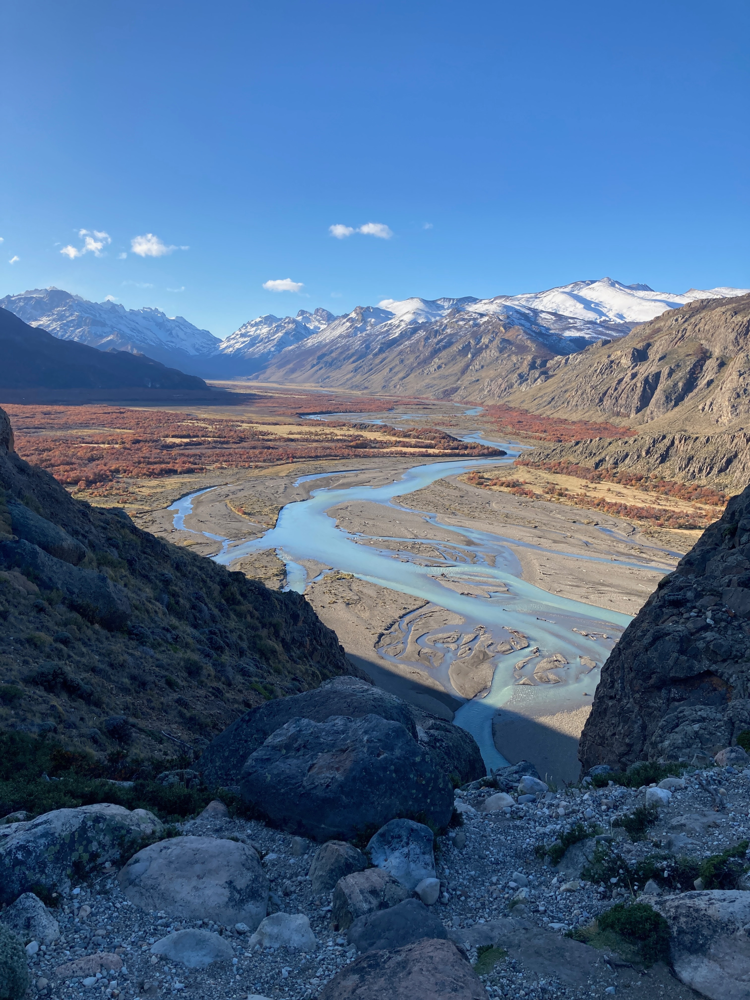
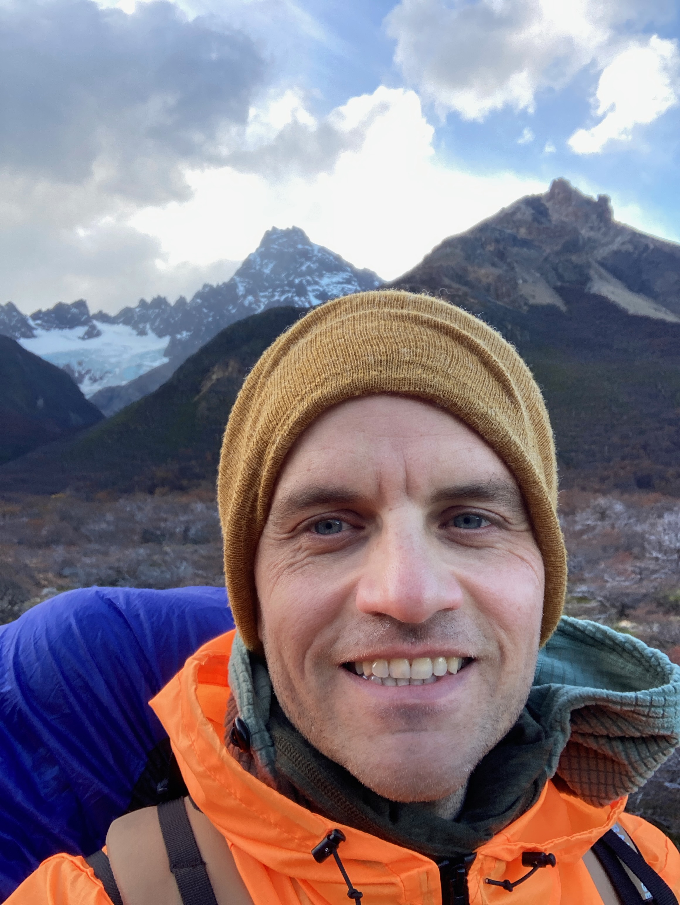
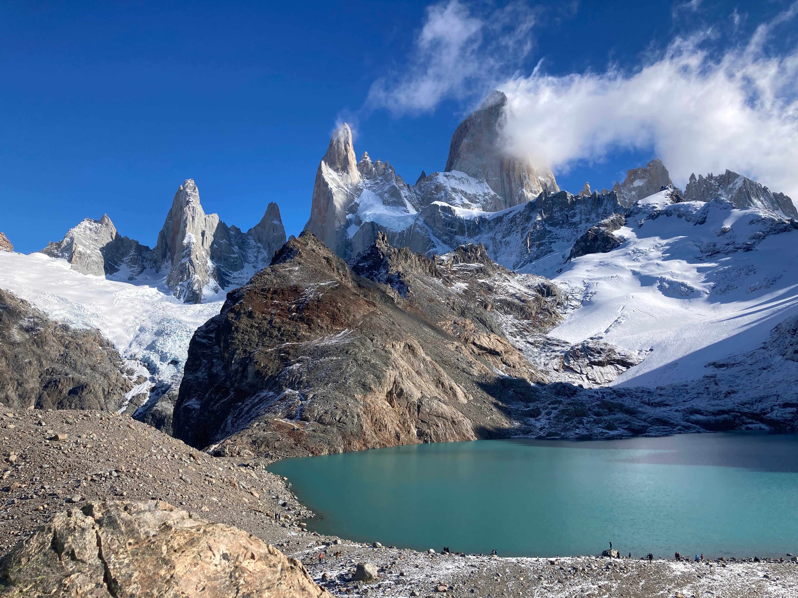
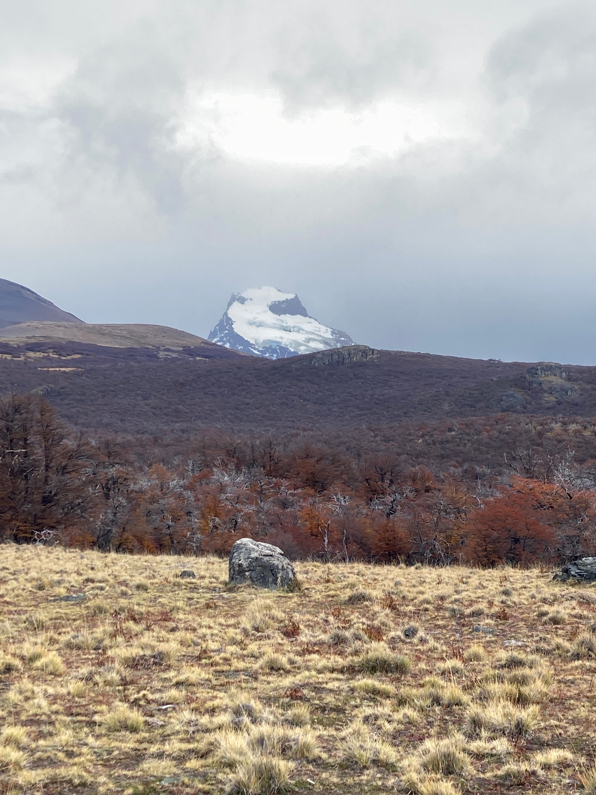
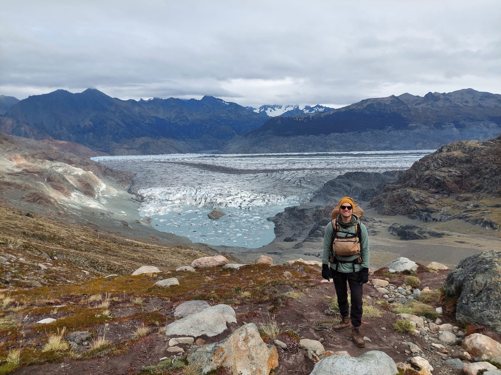
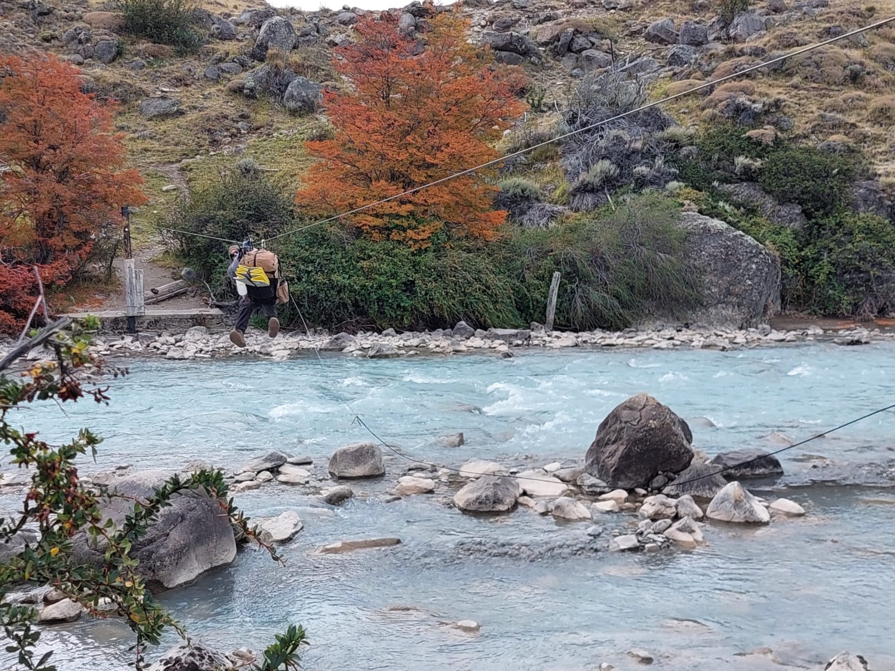
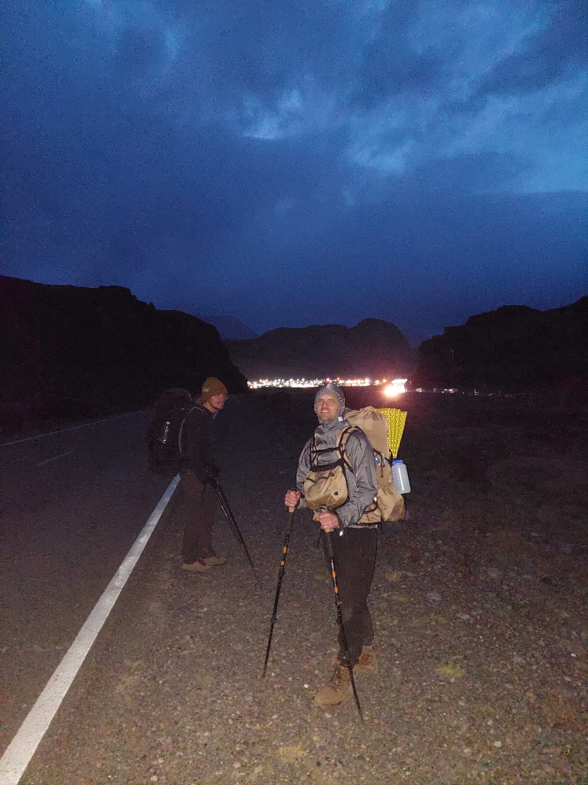

As soon as I stepped into the trail head of the Huemul circuit--the most difficul 4-day trek in El Chalten that does not require a guide--I was faced with a steep hill. To distract my mind from the effort it took to reach the top I started thinking of the theme of the trek. Something I had been thinking a lot about since I started my sabbatical is the skill of how to enjoy oneself regardless of your situation. So I named the Huemul trek: The Art Of Contentment. But by the time I finished the circuit something almost palpable changed in me which completely changed the theme I had assigned it at the start.

In 2019 I summoned the courage to escape my comfort zone. After I had bought my house in Houston I had settled into it and into the Houston lifestyle. I had everything fine tuned to my liking: how the trash can opened as to not annoy me, how my food was prepared weekly so I don't have to worry about it during the week and even my social activities were preplanned to where my friends knew if they don't catch me during that window, it's going to take another week to see me.

But there was one thing that couldn't be squared away and tucked into my neat schedule. The allure of living where home truly is. I ended up in Houston not by choice, but by convenience. The question that had always nagged me was what if I could choose my place, where would it be?

And just like that, I sold all belongings that don't fit in suitecases and started my travels.

As I moved from one place to a more alluring and exciting place there was always this subtle expectation that the next place is it. There is where it will be more like home than any other place. But after a few moves what became apparent to me is what I was bringing with me--in addition to all the stuff that fit in suitecases-- is a way of thinking that if not gotten rid off, my travels would turn into a compulsive chase of something that doesn't exist. This pattern of thinking materializes as minor complaints. When doing my yoga in country A, my mind jumps to country's B studio that better fits my needs. It also materializes in more significant subjects like country A's cuisine is terrible compared to country B's; eating is something I do every day.

At the top of the ascent I was bewildered. Day one is supposed to be the easiest of all four days. Fuck, this trek is going to be difficult.

The theme of The Art of Contentment started to change when I committed my first mistake. One section of the trek includes a trail that is sided by the Rio Tunel Glaciar. The map wanted me to walk on the mountain side. I wanted to walk on the glaciar. I saw a section where the mountain seemed to connect with the glaciar and I thought that's my way in. As I tried to go down the mountain, I slipped and slid down until I reached its bottom. About a 200 meter descent. What looked like a connection from afar was a 3 meter gap from close. There was no way for me to get on the glaciar from that point, which I meant I had to walk up a few hundred meters to get back on the trail. This mistake cost me a couple of hours which meant, I'm probably going to arrive to the next camp ground after dark. This is my first mountaineering experience. It's my first time in Patagonia. It's my first cold weather camping experience. And I was alone.

The way I saw it was I had three options: I haven't crossed the point of no return, so I could go back to the first camp. Or I could keep walking and setup camp off site somewhere, but before dark. Or I could stay the course and plan on finding my way in the dark.

I decided to go with the latter option while tentatively holding the second option as a possibility if things were to go wrong. This would keep me on the official course which breaks up the trail in manageable chunks--I would suffer less tomorrow-- and would capitalize on the fact that I had all I needed in my pack in case I had to alter plans midway there.

I kept climbing the mountain as it started to get dark and cold. Every kilometer I would check in with myself to see how I'm feeling. Whenever unuseful thoughts were surfacing it usally meant one of two things, I'm either thirsty or I'm hungry. It was surprised at how the thoughts were a sign of my hunger and thirst, but not the actual sesations of hunger and thirst. I stumbled into this discovery by chance and if I hadn't, I'm not sure I would have had the willwithal to keep pressing on. I was at my 8th hour of walking and I still had at least two hours ahead of me if I don't get lost.

The theme of my trek had changed from the Art of Contentment to the Art of Being Me. I was going to say Courage, but it's much more than that. I started to realize that everything I had done in the previous years was a combination of fears, overcoming those fears, doing what's right, standing up to what's wrong, doing hard things when the easy things were right there in front of me. These actions little and big were fueling my march forward. Stay the course not matter what, but stop to check if the course is still what I want. I have the impulse of a million kindnesses pushing me forward.

One of the hikers that I had seen on my way saw my headlight from the campsite and I could see his jumping up and down and running with excitement. He ran up to the river that divides the shelter from the trail to guide me to safety. "Is that you? Is that you? You're crazy, you're crazy!" he kept saying for a few minutes until he calmed down. I didn't setup the tent that night. I lay my sleeping back in the shelter and crashed on the ground.

<figure>
    
    <figcaption>Caption</figcaption>
</figure>
<figure>
    
    <figcaption>Caption</figcaption>
</figure>
<figure>
    
    <figcaption>Caption</figcaption>
</figure>
<video width="100%" controls muted poster="assets/ec-zipl1.png">
    <source src="assets/ec-zipl1.mp4" type="video/mp4;">
</video>
<figure>
    
    <figcaption>Caption</figcaption>
</figure>
<figure>
    
    <figcaption>Caption</figcaption>
</figure>
<figure>
    
    <figcaption>Caption</figcaption>
</figure>
<figure>
    
    <figcaption>Caption</figcaption>
</figure>
<video width="100%" controls muted poster="assets/ec-glaciar-tunel-poster.png">
    <source src="assets/ec-glaciar-tunel.mp4" type="video/mp4;">
</video>
<figure>
    
    <figcaption>Caption</figcaption>
</figure>
<figure>
    
    <figcaption>Caption</figcaption>
</figure>
<figure>
    
    <figcaption>Caption</figcaption>
</figure>
<video width="100%" controls muted poster="assets/ec-susia.png">
    <source src="assets/ec-susia.mp4" type="video/mp4;">
</video>
<figure>
    
    <figcaption>Caption</figcaption>
</figure>

---
I'm shifting [my internal clock](/books/internal-time) to be an early riser. Closing apartment shutters at sunset, dimming lights and stopping all screen activities.
