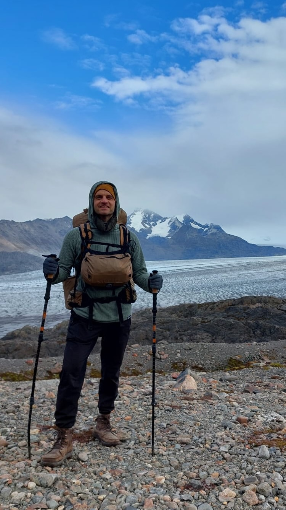

As soon as I stepped into the trail head of the Huemul circuit--the most difficult four day trek in El Chalten that does not require a guide--I was faced with a steep hill. To distract my mind from the effort it took to reach the top I started thinking of a theme for the trek. I had been thinking a lot about the skill of how to enjoy oneself regardless of one's situation, so I themed the circuit: The Art Of Contentment. Little did I know that the challenges that lay ahead would completely change me and the theme.

<figure>
    
    <figcaption>The Huemul Circuit goeas around the Huemul mountain exposing you to multiple epic scenes.</figcaption>
</figure>
In 2019 I summoned the courage to escape my comfort zone. After I had bought my house in Houston several years before, I had settled into it and into the Houston lifestyle. I had configured my life to cater to the principal activity of working: My meals had been prepped every Saturday so I wouldn't worry about eating during the week. My cat's needs had been automated away only requireing a weekly spot check. My social activities had been scheduled in advance and my friends knew if they don't see me then, they'll have to wait until the following week.

But there was one thing that couldn't be squared away and tucked into my neat schedule. The allure of living where home truly is. I ended up in Houston not by choice, but by convenience. The question that had always nagged me was what if I could choose my place, where would it be?

So one day, I sold all belongings that don't fit in suitcases and started my travels.

As I moved to new places there was always this subtle expectation that the next place would be more like home to me. But after a few moves what became apparent to me is what I was bringing with me--in addition to all the stuff that fit in suitcases-- is a way of thinking that if not gotten rid off, my travels would turn into a compulsive chase of the imaginary. This pattern of thinking materializes in many forms. In the middle of my yoga practice in country A, I would imagine how much better it would be to be practicing in country's B studio. When experiencing country's A flavor of prejudice, I would imagine how free and open country's B culture is and how more liberated my future friends would be. As I got tired of tacos and tortillas I would imagine how much more I would enjoy milanesas and napolitanas. This pattern extends to all parts of my life like projects and relationships. How would I be able to ever enjoy myself if I keep training this type of thinking by repeating it over and over? Thus was spawned the theme The Art of Contentment.

<figure>
    
    <figcaption>On day 2 I ran into a couple of Swiss guys. My phone was out of battery, so they took my picture and phone number and texted me the photos a couple of days later. Behind me I think is the Viedma glaciar (Day 3).</figcaption>
</figure>

Exhausted at the top of day one ascent I was bewildered. It is supposed to be the easiest of all four days. This trek is going to be difficult.

The theme started to change when I committed my first mistake. One section of the trek includes a trail that is sided by the Rio Tunel Glaciar. The map wanted me to walk on the mountain side. I wanted to walk on the glacier. I saw a section where the mountain seemed to connect with the glacier and I thought that's my way in. Going down the mountain, I slipped and slid down about 150 meters to the bottom. Luckily, torn pants and a bent hiking pole were the only casualties. What looked like a connection from afar was a three meter gap from up close and there was no way for me to get on the glacier which meant I had to retrace my fall back to the top. What worried me more than my state of exhaustion early in the hike was the fact that now I'll arrive to the next camp ground a few hours after dark. There were too many firsts: My first mountaineering experience. My first time in Patagonia. My first cold weather camping experience. And I was alone.

I had three options: I haven't crossed the point of no return, so I could go back to the first camp. I could keep walking and setup camp off site somewhere before dark. I could stay the course and plan on finding my way in the dark. I decided to go with the latter option while tentatively holding the second option as a possibility for as long as there was sunlight. This would keep me on the official course which breaks up the trail in manageable chunks--I would suffer less tomorrow.

It started to get dark and I only realized how cold my body was when I tried to push a button on my phone and it wouldn't take. It didn't feel like I was pressing. My fingers were numb. I realized that my toes were numb too and my legs were starting to shake. I immediately changed my sweaty base layers and added an insulating layer for warmth. One thing I learned on the previous day is when my thoughts were clouded, it's usually because I'm either thirsty or hungry. The sensations of hunger and thirst weren't there for some reason. So I ate a snack and had a sip of water before deciding what to do next. My new plan was if within a kilometer of walking I still can't sense my fingers and toes I would setup camp as soon as I found a sheltered spot. My fingers and toes were back and I still had three hours of hiking in the dark ahead of me. Three hours of checking my body for anomalies, checking my thoughts for motivation levels and pressing on.

The theme of my trek had changed from the Art of Contentment to the Art of Courage. Not the courage that I was invoking then and there to keep pressing forward, but all the previous acts of courage that I had done up until that point. Overcoming fears, doing what's right, standing up to what's wrong, doing hard things when the easy things were right there in front of me. These actions little and big were fueling my march forward. I had the impulse of a million little acts of courage pushing me forward. And now, I have this new adventure to add.

<figure>
    
    <figcaption>On day one I had a smile tatooed to my face for hours. The scenery on the Huemul circuit does that to you.</figcaption>
</figure>

One of the hikers that I had seen on my way saw my headlight from the campsite and I could see his headlight jumping and running with excitement. He ran up to the river that divides the shelter from the trail to guide me to safety. "Is that you? Is that you? You're crazy, you're crazy!" he kept saying for a few minutes. I didn't setup the tent that night. I lay my sleeping back in the shelter and crashed on the ground.

<figure>
    
    <figcaption>Monte Fitz Roy</figcaption>
</figure>
<video width="100%" controls muted poster="assets/ec-zipl1.png">
    <source src="assets/ec-zipl1.mp4" type="video/mp4;">
</video>
<figure>
    
    <figcaption>Which montain is this?</figcaption>
</figure>
<figure>
    
    <figcaption>Shelter at Camp Toro</figcaption>
</figure>
<figure>
    
    <figcaption>Shelter at Paso De Viento where I spent the night because I arrived at 10pm.</figcaption>
</figure>
<video width="100%" controls muted poster="assets/ec-glaciar-tunel-poster.png">
    <source src="assets/ec-glaciar-tunel.mp4" type="video/mp4;">
</video>
<figure>
    
    <figcaption>Glaciar melting into a lake.</figcaption>
</figure>
<figure>
    
    <figcaption>The last camp where mice destroyed my pack and ate half my food.</figcaption>
</figure>
<figure>
    
    <figcaption>Second line crossing on the circuit. They both cross the same river.</figcaption>
</figure>
<video width="100%" controls muted poster="assets/ec-susia.png">
    <source src="assets/ec-susia.mp4" type="video/mp4;">
</video>
<figure>
    
    <figcaption>Day four! On the third day I joined with a couple of hikers and this was our first sighting of the village after a couple of days of hiking.</figcaption>
</figure>

---
I'm shifting [my internal clock](/books/internal-time) to be an early riser. Closing apartment shutters at sunset, dimming lights and stopping all screen activities.
