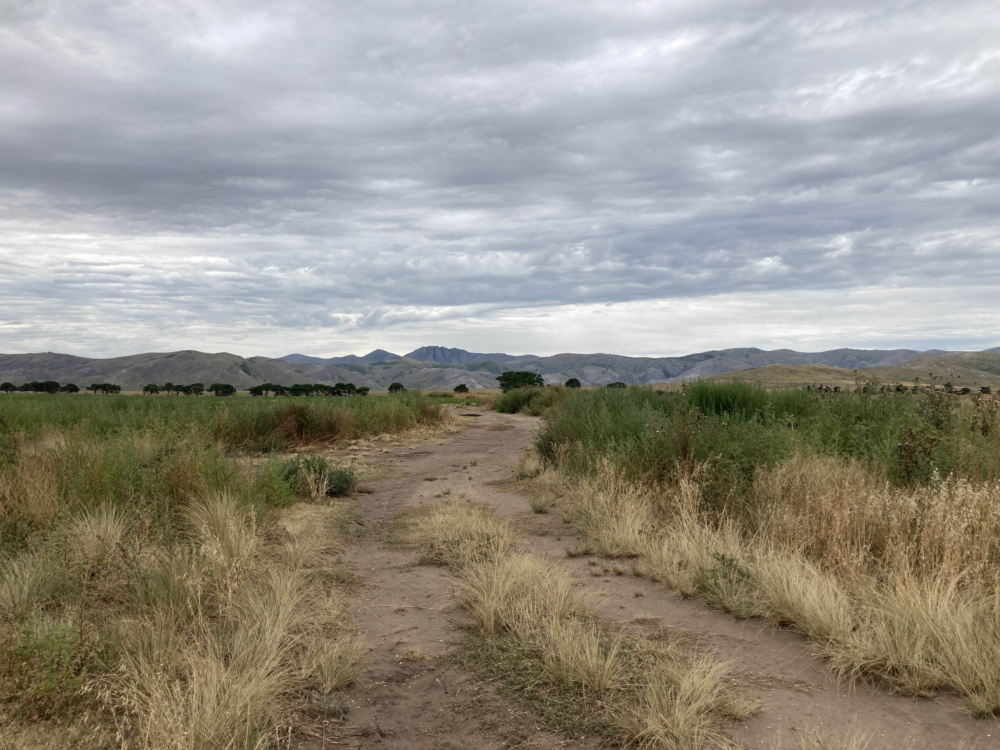
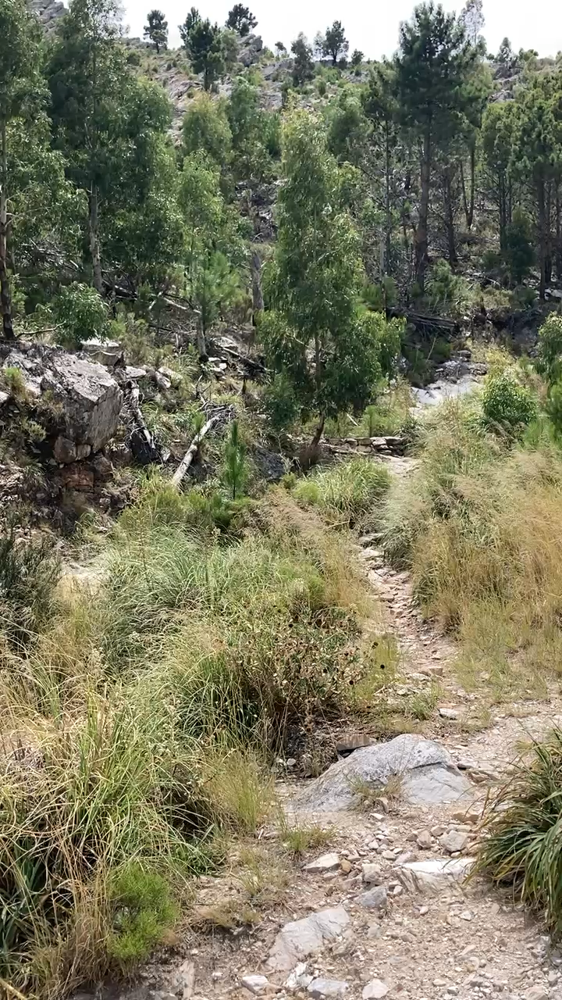
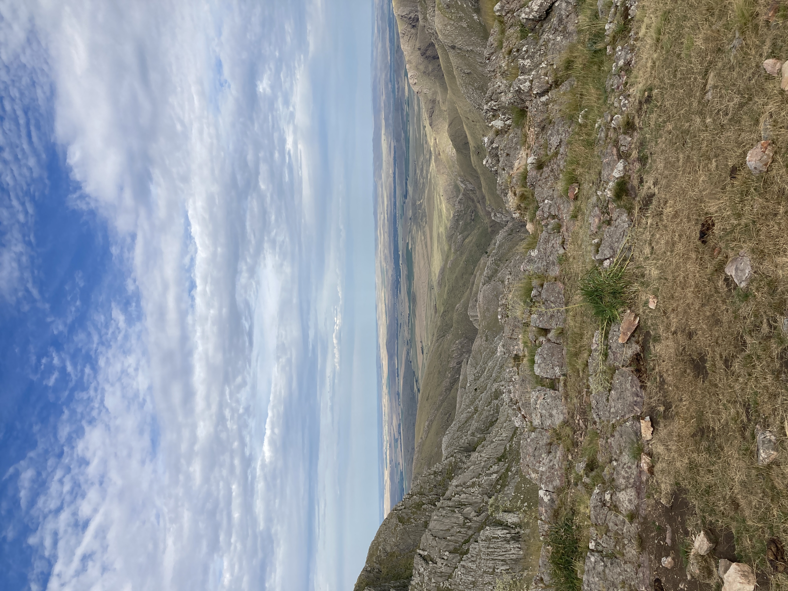
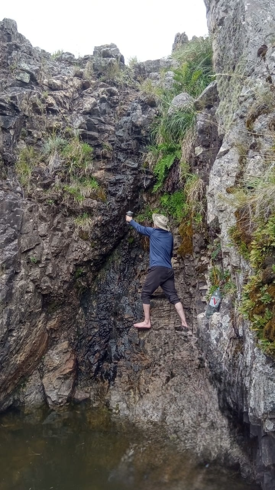
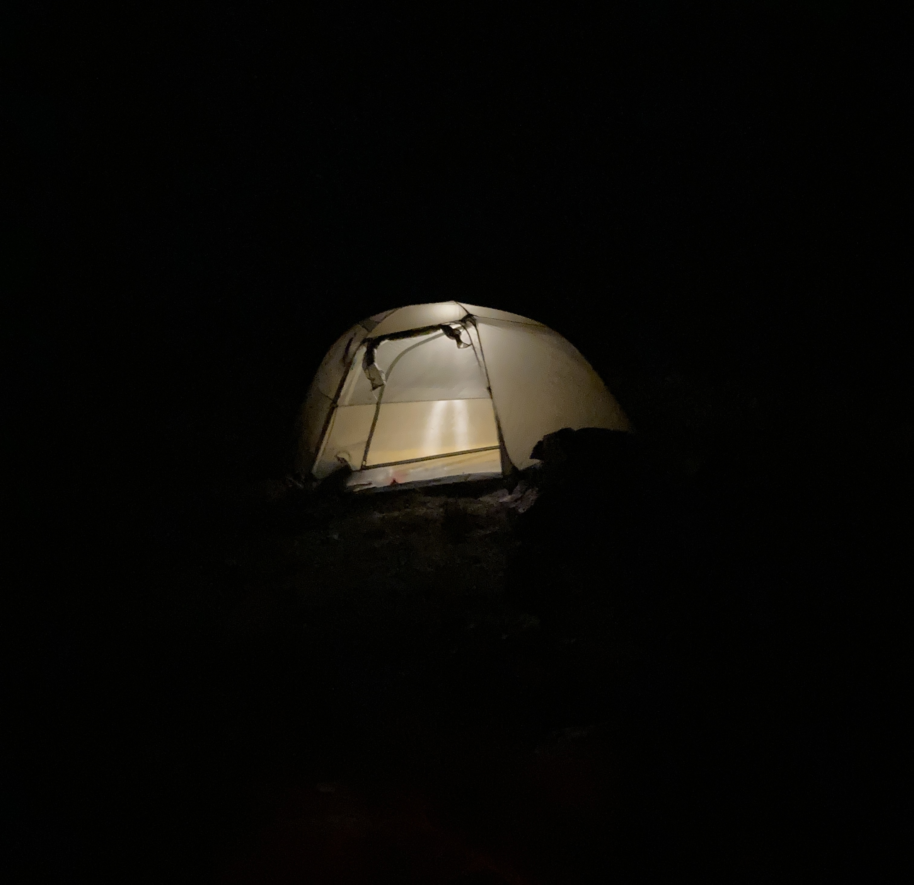

I went on my first solo camping trip in Argentina to the Sierra de La Ventana mountain range[^1]. Looking back at the experience, it felt like I stepped out of Buenos Aires to land in a scene from West World. After a three hour walk through farmland and up a pined mountain slope, the landscape instantly switches from flat and green to dramatic rocky formations with rugged peaks. It was awe inspiring mainly due to this dramatic shift.

I'm currently reading [Wilderness Navigation](https://www.amazon.com/Wilderness-Navigation-Finding-Altimeter-Mountaineers/dp/1594859450) to pickup orientation and navigation skills because I want to go back there and explore the less visited caves and grottoes that I spotted during my hikes. I also want camp in non designated areas like in one of the valleys or less visited caves. I noticed Guanaco feces around the caves; if there's a way to track them and watch them that would be very exiciting!

Notes for next trip:
* My [pack weight](sierra-de-la-ventana-pack) kicked my butt during my 5 hour hike to my destination. I need to figure out ways to lighten it up. Food items seem to be the heaviest. Look into high calorie to weight ratio foods.
* Finish Wilderness Navigation, find a topographic map of Sierra de la Ventana and practice orientation and navigation there.
* Look into Guanaco tracking.
* I realized that I don't know how to properly tie guy lines to stakes. I faked it, but I want to learn a bit of knotcraft to cover the basics.
* Stay a minimum of two nights camping.
* Water is scarce there during the summer. I used my filter, but didn't have time to boil it due to pot size and the time it would take to do so. I would like to be able to prep water a day in advance for the following day. Explore options.
* Check weather variation for the time when you're going. I packed a jacket at the last minute when I checked weather at night. I could have used base layer pants.

<figure>
    
    <figcaption>Walking towards Cerro Tres Picos</figcaption>
</figure>
<figure>
    
    <figcaption>Walk through the pines to get to the top</figcaption>
</figure>
<figure>
    
    <figcaption>Noon view from my tent</figcaption>
</figure>
<figure>
    
    <figcaption>I had to hold that pose for 30 minutes to fill 1.5L of water from the only source around. <i>Weird right foot due to cropping out a person.</i></figcaption>
</figure>
<figure>
    
    <figcaption>Night tent.</figcaption>
</figure>
<video width="100%" controls muted poster="assets/la-ventana-vid-poster.png">
    <source src="assets/la-ventana-vid.mp4" type="video/mp4;">
</video>

[^1]:
