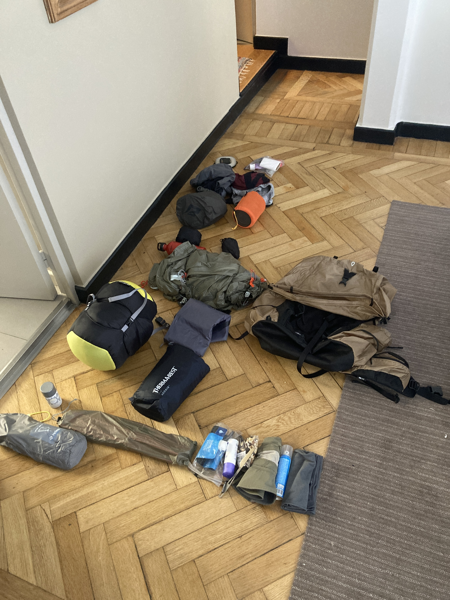
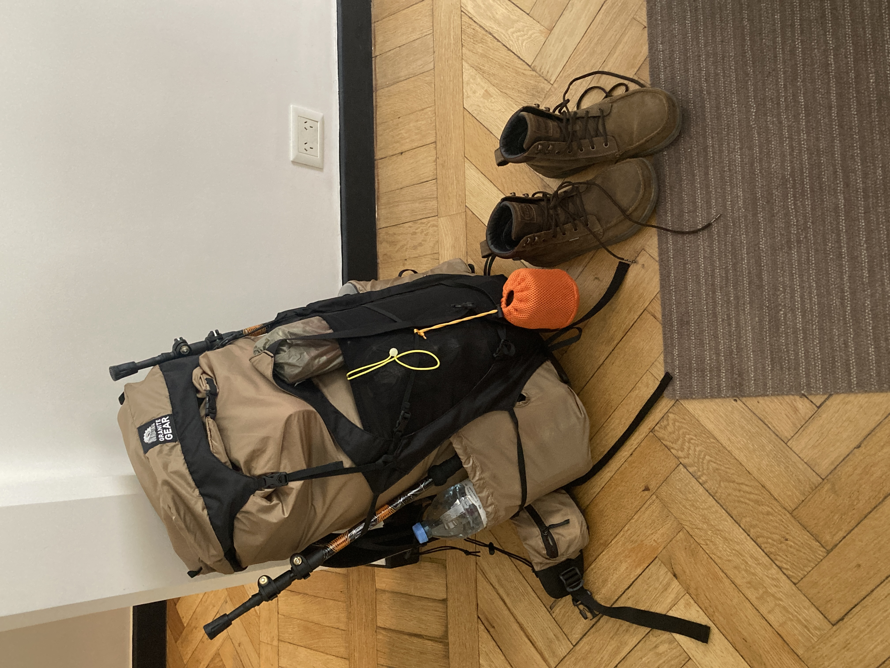
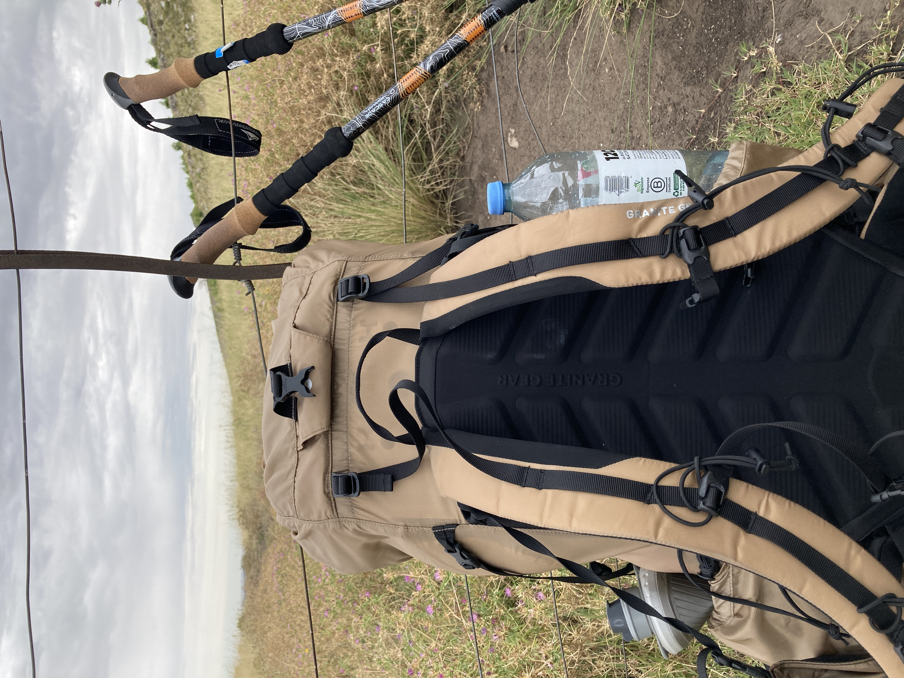

_I couldn't get access to a scale in time before leaving, so I have no idea how much it weighed._

_Items 1 through 7 are packed in that order where Tent goes in first. This seemed like the most comfortable setup. At first I tried sleeping bag first, but that created a bottom bulge that made it very uncomfortable. I should experiment with this some more._

Some modifications I would do:
* Pack a sponge to wash stuff
* Replace hand soap with dish soap since dish soap is stronger and can be used for both.
* Add chapstick. It's very windy there.
* Condiments like onion pouder should be sealed better. My pack smells like onions now.
* Buy:
  * Another collapsibile water bottle, probably 2L
  * Convertible, lightweight pants
  * Lightweight binoculars
  * Big Agnes footprint. I'm using a heavier alternative currently.

1.  Tent
2.  Tent footprint
3.  Clothes not wearing
    * 1p socks
    * 1p underwear
    * 1 t-shirt
    * 1 shorts
    * pajama t-shirt [^2]
    * Lightweight jacket
4. Food bag with food & snacks for 1 night and two days [^1]
    * 3 Ramen
    * 2 tuna
    * 1 cup of pasta
    * 2 cups of cornflakes
    * Coffee
    * Teas
    * Soap
    * Salt & pepper shaker
    * Utensils [^3]
    * Olive oil
    * 3 bags of trail mix
5.  Cooking pot contains:
    * stove
    * lighters
    * aluminum shields
6.  Sleeping pad[^6]
7.  Sleeping bag[^5]
8.  Inflatable pillow
9.  Day pack
10. Stove fuel
11. Water filter system
12. Toiletries:
   * Toothpaste
   * Tooth brush
   * Toilet paper
   * Trash bag for rain and one for trash
   * Deodorant
   * Sunscreen
   * Bug spray
13. 2 1.5L water bottles
14. Light weight towel
15. Lantern
16. Headlamp
17. Compass
18. Whistle
19. Morakniv knife
20. Bug net
21. Sunglasses
22. iPhone and cables for phone, headlight and lamp
23. first aid kit
24. Battery pack
25. Reading glasses [^4]
26. Hat
27. Trekking poles
28. Chair
29. Kindle

<figure>
    
    <figcaption>Everything</figcaption>
</figure>

<figure>
    
    <figcaption>Packed</figcaption>
</figure>

<figure>
    
    <figcaption>On the way back</figcaption>
</figure>

[^1]:  On the first day, I ate breakfast at the gas station, trail mix on the trek, and 1 Ramen for dinner at camp. The next day, I had cornflakes for breakfast and trail mix on the way down to camp (I left at 9am). If I had done a hike that morning, I would have probably ate a cup of pasta or tuna or another Ramen. I overpacked a lot of food because I assumed on the first day that I would have 3 meals and on the following day as well. But the staff informed me that I should leave camp early to make it and checkout before they close to note me as "safely returned". Plan food better next time because it adds a lot of weight.
[^2]: I slept in my underwear and extra t-shirt. Didn't need pajama t-shirt.
[^3]: I should not have taken knife since I had the Morakniv anyway.
[^4]: I can read without them. Shouldn't have taken them.
[^5]: Study its features. Body was warm, but feet felt cold had to wear socks. Temp wasn't below 0 and this is 20F certified.
[^6]: Learn how to fix this pad in case of punctures. It came with tools to fix. It's curcial in rought terrain.
