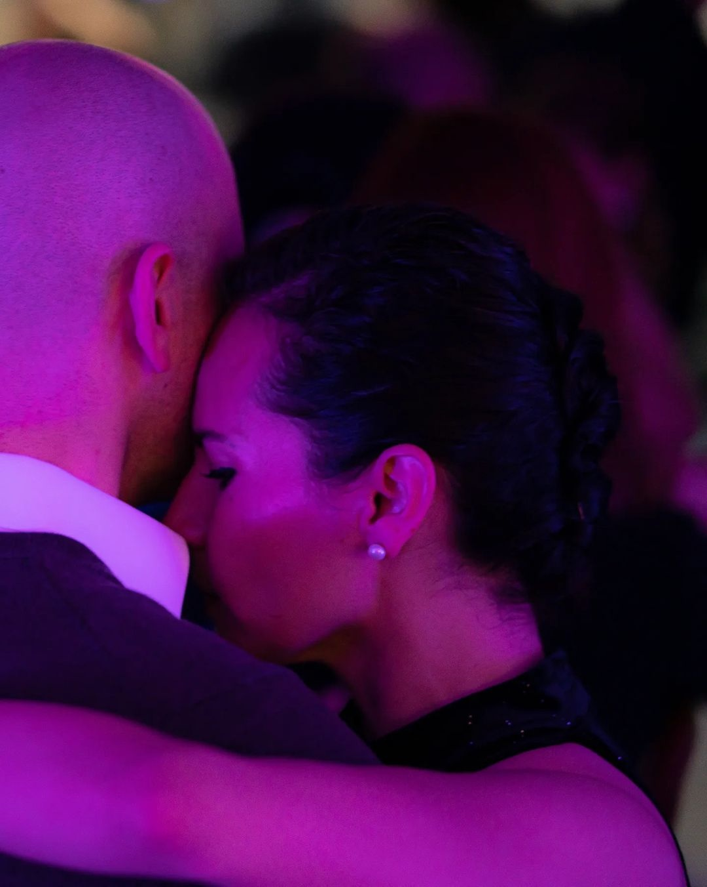

<small>_Last updated on Sep 17, 2025 from Buenos Aires._</small>

## Tango

My time in tango had always been at the periphery. When I look back at how my involvement in it has shaped my life and my relationships I wonder what would happen if I gave it more. This year I stopped wondering and went all in. I'm writing a memoire as I explore its profundity which is surprisingly acting as a guide that is helping me overcome many challenges.

I've recently completed the first [two chapters](https://nashkabbara.com/tango/book/). My current focus is on musicality.

## Voyager Keyboard

I bought my <a href="https://www.zsa.io/voyager">Voyager keyboard</a> in Oct, 2023 and never had the time to break it in. At first, I decided to quickly migrate to it by loading qwerty on it, but then I looked at some [videos comparing](https://www.youtube.com/watch?v=eNeYmr48JUM) querty with modern layouts and I was shocked at how much wrist and finger movement is involved with qwerty. So I decided to learn [graphite](https://github.com/rdavison/graphite-layout). I'm using [keybr](https://www.keybr.com/) to memorize the keys and then will use [MT](https://monkeytype.com/) to get me to 60-80 wpm.

<small>_(This is a now page, and if you have your own site, [you should check it out](https://nownownow.com/about).)_</small>
