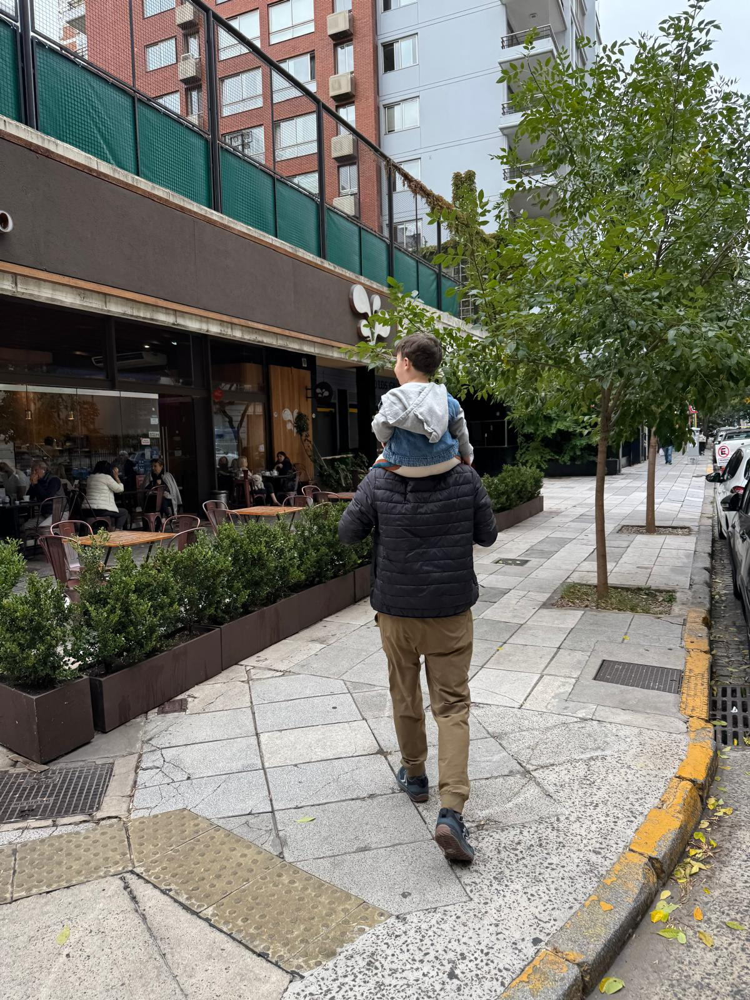

<small>_Last updated on April 13, 2025 from Buenos Aires._</small>

## Reading & Camping

I'm [done with liminal space](/work-begins-after-youre-done) that I had planned after starting my sabbatical and my brother's family visit is over. Now I'm preparing for my [El Chalten trek](camping-in-el-chalten). I bought a one way ticket there in order to work with the weather. The plan is to start with the [Huemul Circuit](https://en.wikipedia.org/wiki/Cerro_Huemul) and imporvise after that.
 
 

 
My nephew, Adam (19kg), helping me train for my upcoming trek.

## Bikram Yoga

I'm a couple of years into Bikram and now can't imagine living without it. It's one of those activities that insidiously grabs you and never lets go. Like a fungus. I'm advanced in a couple of poses, intermediate in a few and beginner in the rest. I focus on one pose for a few weeks or months and once satisfied with some progress, I shift focus to the another one. At this rate, it'll take me several years to reach intermediate/advanced in all poses.

## Argentine Tango

I've been dabbling in tango for several years now, ~~~but now that I live in Buenos Aires I'm starting to go deep. Tango, in its totality, the movement aspect, its social dynamics, and the mindset shifts it demands of you is the hardest thing I've been involved in. It's a complete ecosystem that has enough metaphors to reflect most aspects of life in general.~~

_Since my sabbatical started, my lifestyle shifted from ["Balance Everything"](https://sive.rs/htl27) to ["Commit"](https://sive.rs/htl02). I instinctively dropped tango and all non-essential activities and have been completely focused on reading (my current project). I go camping every few books to distance myself and observe. I'm liking this more than balancing everything._

## Buenos Aires & Spanish Reboot

I moved to Latin America in May 2019 after living most of my life in Houston,TX and I'm still learning Spanish! As soon as my level reached order-food level, complaining-about-slow-internet level, and dating-level I stopped learning and surfed that plateau for a few years. But life in Buenos Aires is very different than the cities I've lived in in Mexico. People here are very friendly and more inclusive than Mexico, so I keep finding myself in Spanish only groups and events. This has generated a renewed motivation to take my Spanish to the next level.

My current routine is 3 in-person classes a week and the rest of the week I study (anki) new words that I couldn't understand in daily conversations with people.

<small>_(This is a now page, and if you have your own site, [you should check it out](https://nownownow.com/about).)_</small>
