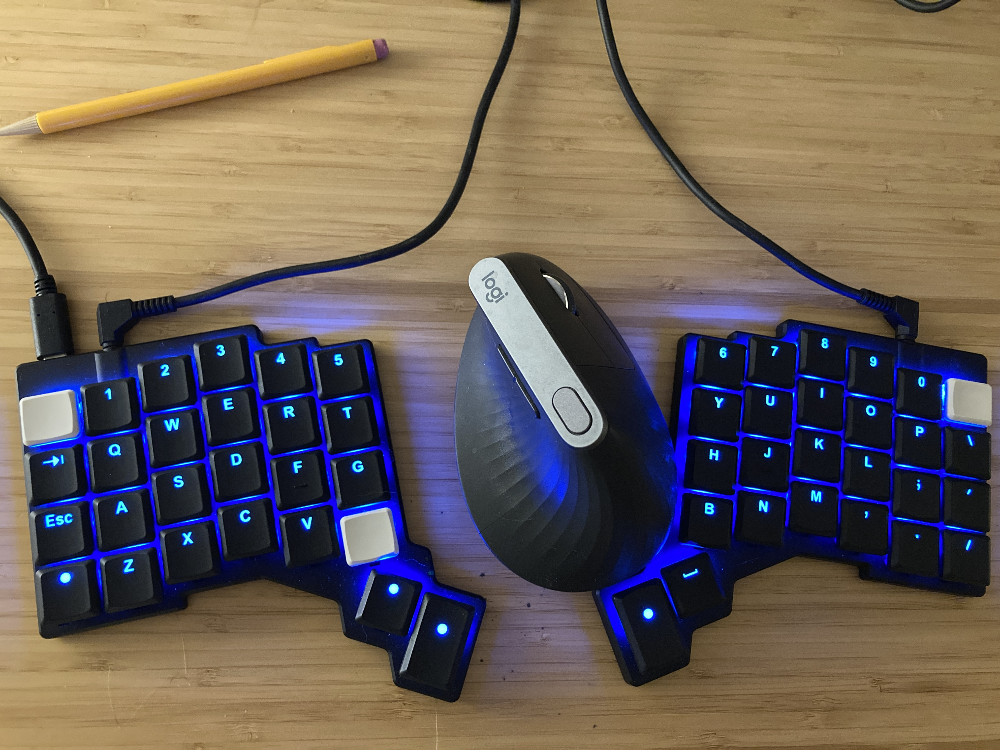

<small>_Last updated on Jan 11, 2026 from Buenos Aires._</small>

## Year In Review

Here's how my [2025 went](/2025-in-review).

## My First Neovim Plugin

I'm currently writing my <a href="https://github.com/nkabbara/onmyterm.nvim">own floating terminal plugin</a> to learn neovims's API. I'm doing this on SUPER hard mode because I'm using [a new keyboard layout](https://github.com/rdavison/graphite-layout). I'm literally mapping missing symbols as I need them and then writing them on a sticky note to remember them. It feels excruciatingly painful and I'm getting tired much sooner than I usually do when coding. This has been an eye opener at how much effect one's setup has on cognitive load. It's forcing me to rethink my workflow and shortcuts to be more seamless.

## Tango

I finised [chapter three](https://nashkabbara.com/tango/book/) of my tango memoir! I'm currently doing research for chapter 4, titled The Centimeter. It's about technique. The research is in the form of learning and applying and codifying technique. I'll move to the writing stage once I have enough material and stories for the chapter. Tango takes about 2 hours a day from me in a combination of private lessons, solo practice, partner practice and daytime milongas.

## Reading & Listening

I started listening to the massive and wonderful [The Story of Civilization](https://www.amazon.com/dp/B074CF5NP9?binding=audio_download&ref=dbs_m_mng_rwt_sft_taud_tkin) series by Will Durant. There's more than 500 hours of listening in there.

I'm currently reading the following books:
* [Food Rules by Michael Pollan](https://www.amazon.com/dp/B002YJK5L4)
* [Practical Vim by Drew Neil](https://www.amazon.com/Practical-Vim-Edit-Speed-Thought)
* [Salt, Fat, Acid, Heat: Mastering the Elements of Good Cooking](https://a.co/d/eq1Kj2l)

## Graphite Layout

I've switched my work computer to [graphite](https://github.com/rdavison/graphite-layout) on Jan 1st. I'm currently at around 40wpm (98% accuracy), but inconsistently. I'm using the <a href="https://www.zsa.io/voyager">Voyager</a> keyboard as my main driver and mapping my home row mods as I go. Once I have this keyboard stabilized, I'll switch my personal laptop to graphite as well using [Kanata](https://github.com/jtroo/kanata).

Why have I decided to make my life temporarily miserable? I saw [videos comparing](https://www.youtube.com/watch?v=eNeYmr48JUM) qwerty with [modern layouts](https://www.youtube.com/watch?v=DKQ4pOoFh5I) and I was shocked at how much wrist and finger movement is involved with qwerty. It's an experiment to see how a new layout will affect my typing experience and my interaction with my computers.

I'm typing daily on Monkeytype for at least 15 minutes working my way from English 200 to English 10K. I'll stop this when I can average 80wpm at 98% accuracy for the last 10 uninterrupted lessons. I have symbols and numbers turned on. I move up a level when I can finish a language setting at 40wpm/98% for average of last 10 successful sessions. Whenever I get bored of Monkeytype, I switch do [burst-type](https://www.burst-type.pro/)

<small>_(This is a now page, and if you have your own site, [you should check it out](https://nownownow.com/about).)_</small>
