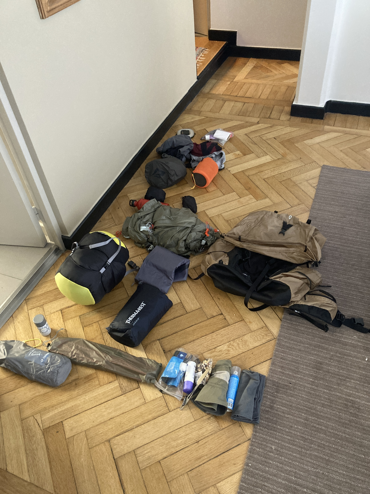
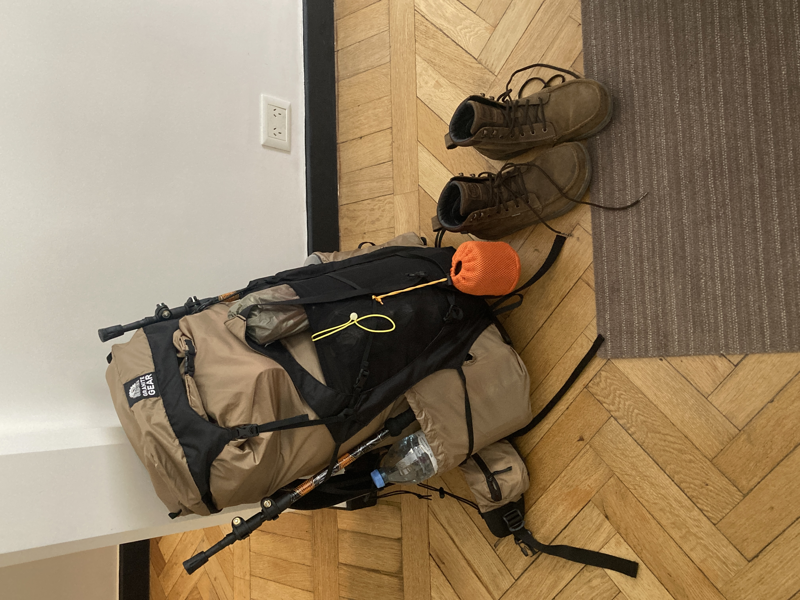
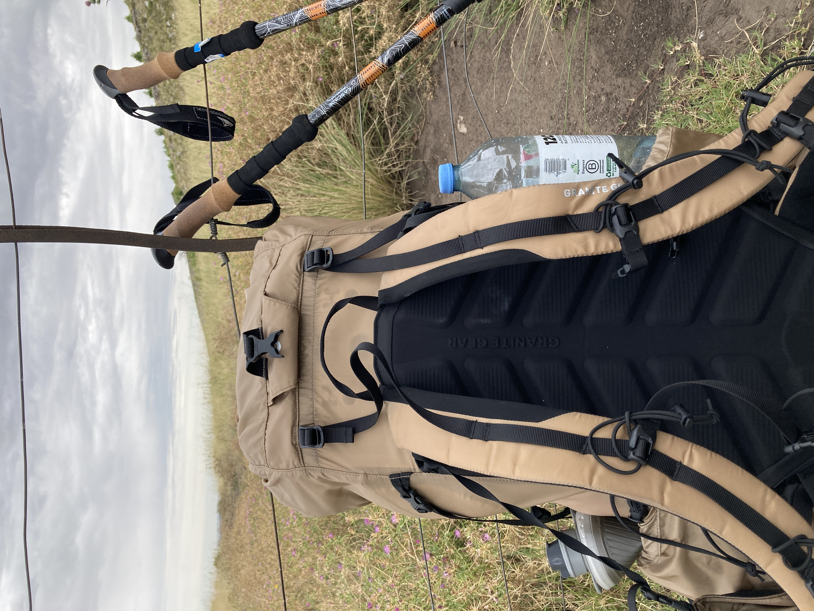

<iframe src="https://docs.google.com/spreadsheets/d/e/2PACX-1vSafKNjjxi7g5Ea2lAsEKDm426Jb4YdS9_7YO6ZrQL1SIGxtQ9XhluYPpzRMD7-lrg9E-kR9gSCEIlz/pubhtml?widget=true&amp;headers=false" style="width:100%; height:500px;"></iframe>

## Packing
1. Configure pack's top of shoulder straps adjustments so that hip belt is exactly on the hip, not lower, nor higher.
2. Mark mid-back point: Wear pack and strap it. Look sideways in mirror and mark pack around middle of your back.
3. The marked point is where the heaviest items should sit. They should be closest to your back; as if an extension of it.

This means lighter items go below and above heaviest items. This translates to sleeping bag first (pad it with some clotes around the corners and curves to fill in empty space), then food bag, sleep system and other heavy items in the middle and close to back. Above that goes the tent and other items.

## Potential Improvements
1. Consider a down sleeping bag to save weight.
2. Look into using candles instead of MSR stove to save weight.
3. Figure out how to improve food. Look into https://www.backpackingchef.com. Good food makes the trip much more enjoyable.

<figure>
    
    <figcaption>Everything</figcaption>
</figure>

<figure>
    
    <figcaption>Packed</figcaption>
</figure>

<figure>
    
    <figcaption>On the way back</figcaption>
</figure>
