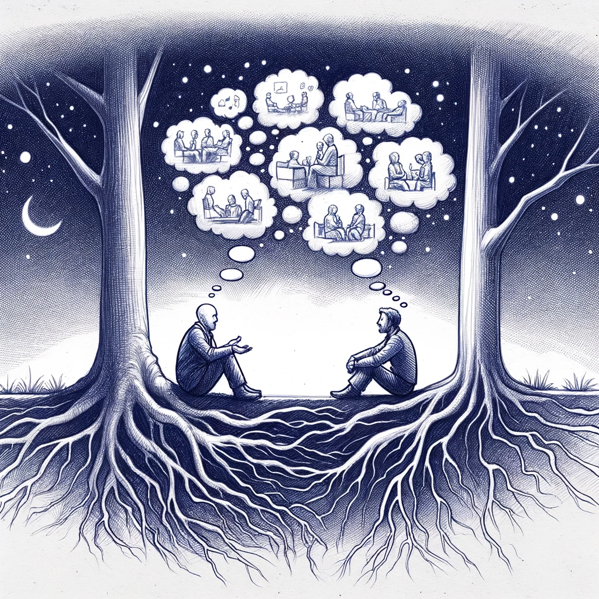

_Home is not where you were born; home is where all your attempts to escape cease. - Mahfouz_

I've lived extensively in the following places throughout my life: Accra, Ghana. Tripoli, Lebanon. Houston, TX. Puerto Vallarta, Mexico. Guadalajara, Mexico. And now in the process of leaving Guadalajara. Where is home for me? None of these places.

I think to call a place home, at least a couple of things must come together: the place must be conducive to deep friendships and it must feel comfortable for enduring heartbreaks [^1].

### Deep Friendships

You make deep friendships in places where people you connect with are in abundance. I'm attracted to people that have a deep interest in a subject be it a hobby or their vocation and are comfortable making themselves vulnerable.

When you have a deep interest in a subject and do the hard work of attaining a deep understanding of it you will start to draw metaphors that apply to different areas of life. These metaphors are fertile grounds for conversation and connection. In such pursuits, comfort with vulnerability is essential because you will feel the weight of ignorance crushing your sense of self perceived importance.

The shape of conversation with these folks tend to branch off into sub topics which in turn branch off into more sub topics, by the end of the night you will have several unresolved threads leading into many more evenings of conversation. This process keeps repeating and as it does, you start to sense a deepening in your friendship. It feels like you and your friend are like trees on the surface and your roots below the surface are crossing, deepening and intertwining.

Find a place with a lot of resilient people[^2] with deep interests and you've found a place closer to home.

### Enduring Heartbreaks

Learning how to let your heart heal after a heartbreak is a skill that will free you from the shackles of comfort and familiarity. One thing that I realized that makes heartbreak not only bearable, but also sprinkled with glimpses of joix-de-vivre is being in a place that is full of heartbreak. I think a place with a deep history full of people that identify and share that history is such a place.

I was on a walk in an ancient city with a good friend and he pointed to a corner and recounted the story that his grandfather told him about his first heartbreak that took place right at that corner. Walking that city feels like you're constantly stepping on someone's heartbreak. Walking its streets with a broken heart, you feel hopeful because many grandfathers recovered from their broken hearts. They lived long enough to recount their stories to their grandchildren who are now your friends.

Find a place with infinite heartbreaks and you're closer to home.

### Questions About Places

- Would you want to grow old in this place?
- Would you be OK being poor in this place? How about rich?
- Would you be OK being stuck in this place and never be able to leave ever again?

---

[^1]: a caveat is that the culture of this place must be open receiving foreigners. Many cultures that don't have strong immigrant roots tend to make it hard for non natives to feel at home.
[^2]: the assumption here is that the basics are covered: walkability, strong public transport, mild winters & summers, parks & nature and good food.
