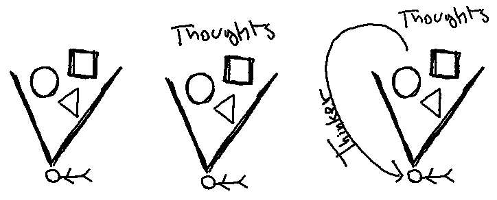
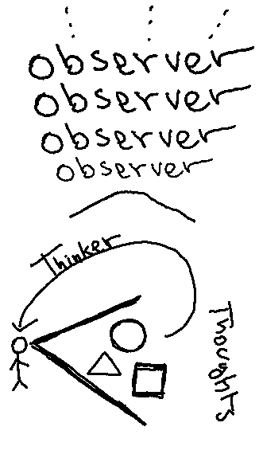

# Conventionally

You enjoy your job and have the respect of your colleagues at work. At home, your kids
run to you right when you pull into the driveway and your wife adores you. And so do your dogs.
Your cat, not so much.

You have your poker nights with your best friends every Friday at 10pm. They have the best
intentions towards you. And you towards them.

You've worked really hard so that you can retire comfortably. You're in good health for the
most part and you're looking forward for having grandchildren.

_You_ are all those things combined. **Really?**

# Not(s)

- You're not your body. Your body changes drastically every few years.
- You're not your thoughts. You change your mind more often than your body changes.
- You're not your posessions. You lose stuff and gain stuff all the time.
- You're not your religion. You may convert from Christianity to Buddhism any day.
- You're not your culture. You may move to another country and build a life there.
- You're not your family. They have their own lives and you'll probably end up seeing them once a year.
- You're not your character. Experiences change it as you carry on.
- You're not your reputation. That changes with every action you take.
- You're not your career. Your industry might be disrupted and you'll have to change careers.

What's left is _you_. **But what is left?**

# Experientially

Think back as far as you can. What consumed you? Mostly likely objects. All you thought about were objects.

Now, from that point, move forward a couple of decades. What consumed you? Most likely, you started to think about your own thoughts.

Let's move forward again and assume you meditate or are able to disassociate somehow. Are you starting to think about the thinker? The thinker thinking thoughts about objects?

Now, we're starting to get sophisticated. If there's a thinker that's thinking thoughts about objects and you're
observing that whole phenomenon, then who is the you observing the thinker think thoughts about objects?

And apparently, you're now observing the you observing the thinker think thoughts about objects. We just added another observer.

**How many observers back can we go until we get to the real you?**
